```{r, echo=FALSE}
library(metathis)
meta() %>% 
  meta_description(params$event) %>% 
  meta_name("github-repo" = paste0("datactivist/", params$slug)) %>% 
  meta_viewport() %>% 
  meta_social(
    title = params$title,
    url = paste0("https://datactivist.coop/", params$slug, "/1"),
    image = params$image,
    image_alt = params$image_alt,
    og_type = "website",
    og_author = "Datactivist",
    og_locale = "fr_FR",
    og_site_name = "Datactivist",
    twitter_card_type = "summary",
    twitter_creator = "@datactivi_st")
```


layout: true

`r paste0("<div class='my-footer'><span>", params$event, "</span> <center><div class=logo></center></span></div>")` 

---

class:center, middle

Ces slides en ligne : `r paste0("http://datactivist.coop/", params$slug)`

Sources : `r paste0("https://github.com/datactivist/", params$slug)`


Les productions de Datactivist sont librement réutilisables selon les termes de la licence [Creative Commons 4.0 BY-SA](https://creativecommons.org/licenses/by-sa/4.0/legalcode.fr).

<br />
<br />

.reduite[]
---

class: inverse, left, middle

# Comprendre la démarche de visualisation de données

???

Que signifie visualiser des données ?

---

## Commençons par un exercice de visualisation

--

Selon l'Organisation internationale des migrations, 3108 migrant·e·s ont trouvé la mort ou sont disparu·e·s durant le premier semestre 2017.

--
- 2259 en Méditerranée
- 225 en Afrique du Nord
- 148 à la frontière américano-mexicaine
- 136 en Afrique subsaharienne
- 103 dans la Corne de l'Afrique
- 91 dans les Caraïbes
- 45 en Asie du Sud-Est
- 34 en Amérique centrale
- 33 en Europe
- 31 au Moyen-Orient
- un·e en Amérique du Nord
- un·e en Asie du Sud
- un·e en Asie de l'Est.

---

### Une autre représentation

.center.reduite[]

.footnote[*The Guardian*, "[Migrant sea route to Italy is world's most lethal](https://www.theguardian.com/world/2017/sep/11/migrant-death-toll-rises-after-clampdown-on-east-european-borders)", 11/09/2017].
---

### Que s'est-il passé ?

- Notre cerveau a tenté de se .red[**représenter**] les données qui nous étaient fournies. Il a utilisé ses capacités *d'imagination*.

--

- La carte propose une .red[**représentation**] visuelle des mêmes données.

--

- Cette représentation s'avère cependant plus fidèle, plus lisible et plus éloquente. Elle fait le travail qu'a tenté d'accomplir notre cerveau mais en y ajoutant des précisions, une clarté et un message .red[**hors de sa capacité de traitement**].

--

- La datavisualisation agit donc comme un .red[**outil cognitif**] pour nous aider à comprendre les données.

--

- C'est ce qu'*Alberto Cairo* nomme la .red[**valeur fonctionnelle**] de la datavisualisation.


.footnote[Alberto Cairo, *The functional Art*, 2012 ;
*The truthful art*, 2016. À retrouver [sur son site web](http://www.thefunctionalart.com/).]

---
## Démarche d'encodage / décodage

- La visualisation de la donnée consiste en un .red[**encodage**], c'est-à-dire une "conversion" d'un format à un autre.

--

- En l'occurrence, le passage d'une forme brute non interprétée (les *data*), à une forme raffinée interprétée (la *dataviz*).

--
- Comme dans le journalisme, la mise en forme implique également un **angle**, un *message* que doit transmettre l'image.

--

- Nous avons donc trois ingrédients indispensables à la démarche :
1. des données ;
2. une mise en forme ;
3. un message.

???

Par conséquent, trois compétences à maîtriser : la donnée, la mise en forme, le message.

---

### Un exemple simple

Le *New York Times* a publié un article sur l'impact du Covid-19 sur les plus de 65 ans.

.center.reduite[
[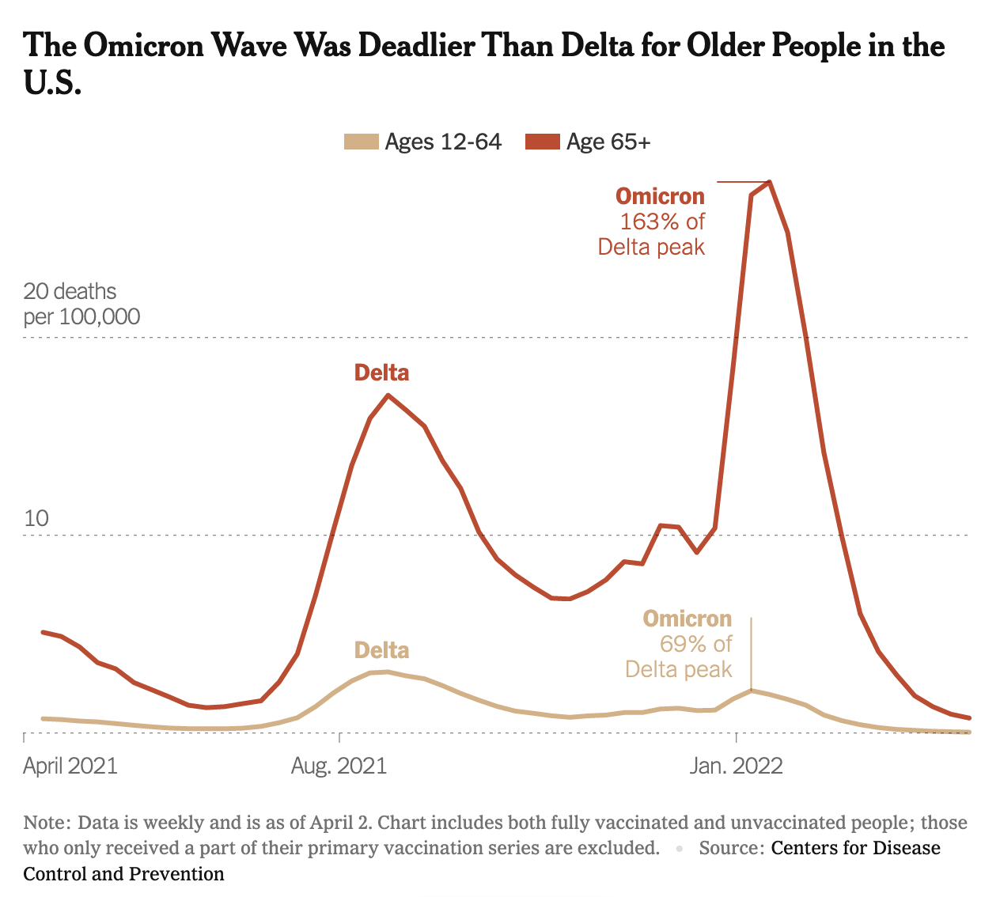](https://www.nytimes.com/2022/05/31/health/omicron-deaths-age-65-elderly.html)
]

???

* Données : CDC
* Mise en forme : deux courbes superposées
* Message : impact sur les > 65 ans

---

## Qu'est-ce qu'une bonne dataviz ?

### **Trois qualités indispensables**

.center.reduite3[

]

---
class: inverse, center, middle

# Premier objectif :
# la rigueur

---
## Comprendre la nature et le sens des données

- La dataviz étant un encodage, elle substitue aux données des équivalences visuelles.

--

- L'encodage doit permettre :
1. de comprendre **la nature** des données ;
2. d'apprécier **le rapport** qu'elles entretiennent entre elles ;
3. de saisir les points saillants et **phénomènes** clefs ;
4. le tout sans déperdition de sens.

--

- Chacun de ces aspects repose sur des caractéristiques visuelles liées à des représentations.

---

### Expliciter la nature de la donnée

.pull-left[
([source](https://www.nytimes.com/interactive/2018/03/19/upshot/race-class-white-and-black-men.html))]

.pull-right[L'encodage doit permettre de saisir immédiatement le sens de chaque élément : 
* où sont les points de données ? 
* que représentent-ils individuellement / collectivement ?

.footnote[La dataviz explicite ici le phénomène lui-même. Il s'agit du point de départ de la démarche journalistique. Les causes, elles, sont explorées et détaillées dans le texte.
]
]

???

Faire participer le public

---

### Choisir la représentation adaptée au phénomène

Un mauvais choix graphique peut fausser la représentation de la donnée en ne donnant pas à constater le phénomène qu'elles permettent de décrire.

.center.reduite2[
[](http://www.geologyin.com/2015/11/network-analysis-shows-systemic-risk-in.html)
]

???

Le graphe veut faire passer l'idéer d'un risque systémique ? On ne la voit pas du tout.

---

### Choisir le bon niveau de granularité

Le niveau de précision minimale d'une donnée (aussi appelé **.red[granularité]**) peut modifier de façon radicale la lecture d'une phénomènne.
Dans le cas d'une carte, le choix de l'échelle peut mener à la généralisation de phénomènes extrêmement circonscrits (ou inversement) comme le montre cet [exemple sur le blog de Datawrapper](https://blog.datawrapper.de/weekly-chart-europegrowth/)

.pull-left[

]

--

.pull-right[

]

---

### Des graphs ni faits ni à faire

Le choix de l'échelle est aussi celui de son étendue. Il peut être tentant pour amplifier un phénomène d'en augmenter l'amplitude artificiellement en réduisant l'échelle.
L'exemple le plus courant est le ".red[data-does-not-start-at-zero]". Si ce choix peut se justifier, il est bien souvent utilisé comme méthode de manipulation.

.pull-left[]
.pull-right[]


.footnote[Jean-Marc Manach, "[Plus la délinquance baisse, plus la violence augmente](https://web.archive.org/web/20140917235356/http://owni.fr/2011/01/25/plus-la-delinquance-baisse-plus-la-violence-augmente/)", *Owni*, Janvier 2011
]

---

### Des graphs ni faits ni à faire

.pull-left[
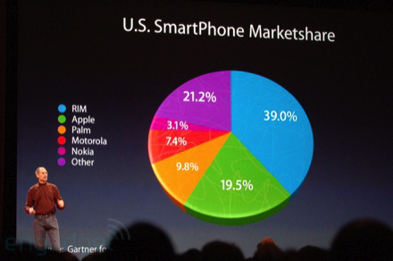

.footnote[Vandy Berten, "[Comment mentir avec un graphique](https://www.smalsresearch.be/comment-mentir-avec-un-graphique/)", *Smals Research*, Juillet 2015]

]

--

.pull-right[
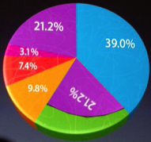
]

???

Les portions placées vers l'avant sont augmentées d’une “tranche” que n’ont pas les segments opposés, et la perspective diminue la surface des segments les plus éloignés. 

---
class: inverse, center, middle

# Deuxième objectif :
# la lisibilité

---

### Un arbitrage nécessaire

L'allégorie de la carte "à l'échelle 1:1" de Borges donne une bonne idée du problème :

.left-column[


.footnote[Jose Luis Borges, "De la rigueur de la science", 1946]

]

.right-column[
> En cet empire, l'Art de la Cartographie fut poussé à une telle Perfection que la Carte d'une seule Province occupait toute une ville et la Carte de l'Empire toute une Province. Avec le temps, ces Cartes Démesurées cessèrent de donner satisfaction et les Collèges de Cartographes levèrent une Carte de l'Empire, qui avait le Format de l'Empire et qui coïncidait avec lui, point par point.
]


---

### Un arbitrage nécessaire

Lewis Carroll en donnait déjà une version absurde :

.left-column[

.footnote[Lewis Carroll, *Sylvie et Bruno*, 1893]
]

.right-column[
> — "Et puis est venue l'idée la plus grandiose de toutes. En fait, nous avons réalisé une carte du pays, à l'échelle d'un mile pour un mile !"

> — "L'avez-vous beaucoup utilisée ?" demandai-je.

> — "Elle n'a jamais été dépliée jusqu'à présent", dit Mein Herr. "Les fermiers ont protesté : ils ont dit qu'elle allait couvrir tout le pays et cacher le soleil ! Aussi nous utilisons maintenant le pays lui-même, comme sa propre carte, et je vous assure que cela convient presque aussi bien."
]

???

Toute carte est une modélisation et donc – par définition – une abstraction et une simplification de la réalité. Une carte sans réduction d’échelle n’aurait ni intérêt ni pertinence. 

---

### 1<sup>er</sup> risque : "l'overplotting"

En statistique, le terme "overplotting" se réfère à l'effet produit par l'intégration d'un trop grand nombre de points de données dans un graph, le rendant illisible.

*Note : c'est un vrai terme de stat, vous pouvez l'utiliser pour vous la jouer.*

--

Exemple : une heat-map qui ne sert à rien

[](https://twitter.com/Eurosport_FR/status/1009836270376366081/)

???

Carte de chaleur = matrice dont les cellules sont colorées en fonction des valeurs de la variable représentée

---

### 2<sup>e</sup> risque : "l'overcomplicated"

L'autre risque courant est de multiplier les dimensions et axes de lecture jusqu'à rendre le graphique incompréhensible.

--

*Note : ce terme n'a rien d'officiel, ne l'utilisez pas pour vous la jouer.*

--

.pull-left[]

.pull-right[[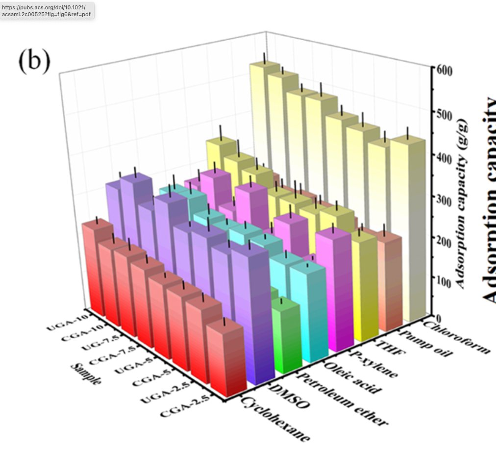](https://twitter.com/DevilleSy/status/1524283900238999560)]

---

### 3<sup>e</sup> risque : l'excès d'esthétisme

La tentation de mêler précision et esthétique peut produire de très beaux graphs… trop compliqués pour être compris du premier coup.

--

.center.reduite3[
[](./img/NebuleusePublicPrive.png)
]

.footnote[Martin Grandjean, *Pegasus Data*]
???

Un super papier, un très beau visuel mais un concept tordu

---

### Laissez parler les données

Les fioritures peuvent constituer des distractions : quand les données sont claires, autant leur laisser le champ libre.

<br />

.pull-left[]
.pull-right[]

.footnote[
Nazirah Jetha, "[5 data-viz tips to let your data speak for itself](https://www.tableau.com/about/blog/2016/5/5-tips-effective-visual-data-communication-54174)", Mai 2016
]

---

### Sans message, l'image devient vaine

Il peut arriver que la dataviz n'ait d'intention que décorative ou spectaculaire. Précise et lisible, elle devient un panneau vide de sens et de propos qui n'explicite rien du monde faute de choisir comment parler de son sujet.

--

.pull-left[
Ex. : une "visualisation concrète de la dette française" qui n'a aucun sens
]
.pull-right[
[](http://www.slate.fr/story/92749/dette-publique-francaise-stade-de-france)
]

---
class: inverse, center, middle

# Troisième objectif :
# l'éloquence

???

Caractère de ce qui, sans paroles, est expressif, significatif, probant.

---

### Donner des points de repère

La façon la plus simple de mettre en avant un message reste encore de l'expliciter : souligner des points saillants ou relever les infos clefs permet de guider dans la lecture.

--

Ex. : rubrique DataMatch de Paris Match

[](https://askmedia.fr/blog/ask-media-pour-paris-match-ya-t-il-trop-daeroports-en-france/)

???

Paris Match veille à semer des focus ou à donner des clefs de lecture.

---

### La symbolique comme message

Le choix d'une représentation figurative allégorique plutôt que littérale peut constituer en soi l'angle d'une dataviz. Claire et bien choisie, la référence agit alors comme un sous-texte à l'image.

--

*Cf.* exemples ci-après.

---

Pour illustrer la censure en Iran, l'équipe de *Journalism is not a crime* a adopté l'esthétique des mosaïques d'Ispahan, faisant écho à l'imaginaire visuel du pays et à sa grandeur. Contrepied de la politique de censure menée par le régime ainsi dénoncé.

<br />

.center[
[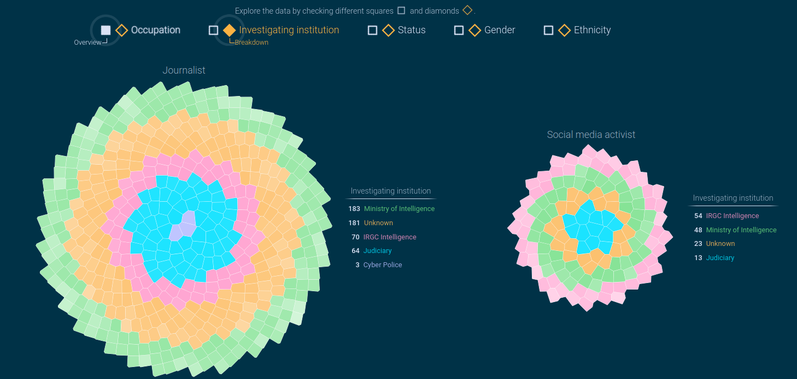](https://visualization.journalismisnotacrime.com/)
]

---

En proposant de visualiser l'immigration comme des anneaux de croissance plutôt que comme des flux, le designer d'information Pedro Cruz modifie la lecture d'un phénomène, basculant d'un registre visuel de la pression à une référence à la consolidation.

.center.reduite[
[](https://twitter.com/i/web/status/1010012782253826048)
]

---

## Permettre l'exploration

Des visualisations interatives peuvent inviter à l'exploration.

Ex. : *El Pais* a souhaité aborder la question du logement à Madrid en prenant le point de vue des habitant·es en recherche de logement.

[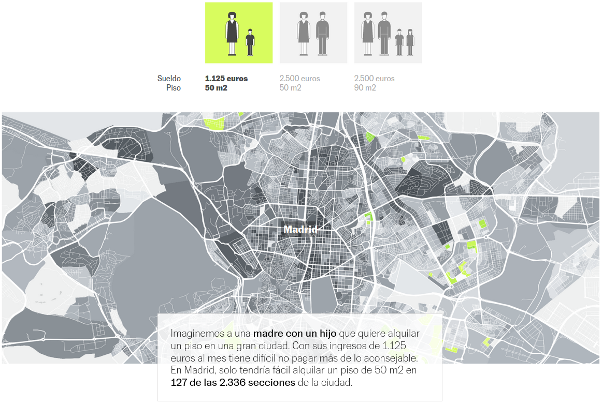](https://elpais.com/economia/2021-11-21/quien-puede-alquilar-y-donde-el-mapa-del-acceso-a-la-vivienda-calle-a-calle-y-familia-por-familia.html)

---

### Faire appel à d'autres sens
Le message peut aussi passer par d'autres sens que la vue : l'ouïe, le toucher…

Ex. : le designer d'information Duncan Geere [a mis en son](https://blog.duncangeere.com/london-under-the-microscope/) une année de Covid-19 à Londres (une seconde = un jour) avec une ligne de basse pour les déplacements, deux notes séparées par un octave pour les cas et les décès, et des "pings" qui représentant des événements soudains (confinement, variant…).

.center[<iframe src="https://player.vimeo.com/video/571217327?h=21098203b9&color=e6e0e0" width="640" height="360" frameborder="0" allow="autoplay; fullscreen; picture-in-picture" allowfullscreen></iframe>]

---

## Quel message veut-on faire passer ?


- Une dataviz porte avant tout une **intention**, la volonté de transmettre une information.

--

- De cette intention découlera le **type de dataviz** à utiliser.

--
<br />
<div style="text-align: center">
 
</div>

---

class: inverse, left, middle

# Panorama des fonctions et des formats de visualisation de données

---

### Panorama des fonctions et formats

**Connaissez-vous le "Data Viz Project" ?**
https://datavizproject.com/

.pull-left[
- Comparaison
- Visualisation de concept
- Corrélation
- Distribution
- Données géographiques
- Une partie d'un ensemble
- Changement de valeur dans le temps
]


.pull-right[
.center[.reduite[]]
]

---
### Panorama des fonctions et formats

**Connaissez-vous le projet "From Data to Viz" ?** 
https://www.data-to-viz.com


.center[.reduite2[]]

---

class: inverse, left, middle

# Panorama des outils de visualisation de données


---
### Des outils en fonction des usages
.center[.reduite[]]

---
### .red[RAWGraphs]
.center[.reduite[]]
#### .center[https://rawgraphs.io/]

---
### .red[Flourish]
.center[.reduite[]]
#### .center[https://app.flourish.studio/templates]

---
### .red[Datawrapper]
.center[.reduite[]]
#### .center[https://www.datawrapper.de/]

---
### .red[Highcharts]
.center[.reduite[]]
#### .center[http://editor.highcharts.com/full.html]

---
### .red[Tableau public]
.center[.reduite[]]
#### .center[https://public.tableau.com/fr-fr/s/]

---

### .red[Infogram]
.center[.reduite[]]
#### .center[https://infogram.com]

---
## .red[Khartis]
.center[.reduite[]]
#### .center[http://www.sciencespo.fr/cartographie/khartis/]

---
## .red[macarte.ign]
.center[.reduite[]]
#### .center[https://macarte.ign.fr]

---
class: inverse, left, middle

# Ateliers pour réaliser facilement des visualisations de données

---
### .red[L'histogramme]

.pull-left[
- **Pour** :  des données avec différentes catégories ou dénominations

- **Avantages** : simple à créer et à comprendre

- **Règles** :
  1. Ne pas surcharger
  2. Nommer systématiquement les axes
  3. Commencer vos axes à 0 (quand il s'agit de données quantifiables)
]
<Br>
<Br>
.pull-right[.reduite[]]

???

Ou diagramme en bâtons, à barres…

L’axe vertical d’un graphique doit toujours commencer à zéro, s’applique uniquement pour des valeurs pour lesquelles le zéro à une valeur intrinsèque, et signifie l’absence de quantité.

---

### Atelier sur les résultats de l'élection présidentielle de 2022

.pull-left[
- Allez sur http://www.interieur.gouv.fr/Elections/Les-resultats/Presidentielles

- Cliquez sur "Résultats de l'élection présidentielle 2022"

- Choisissez votre département sur la carte

- Sélectionnez et copiez le tableau avec l'ensemble des candidats du 1er tour.
]


.pull-right[
.reduite[]
.reduite[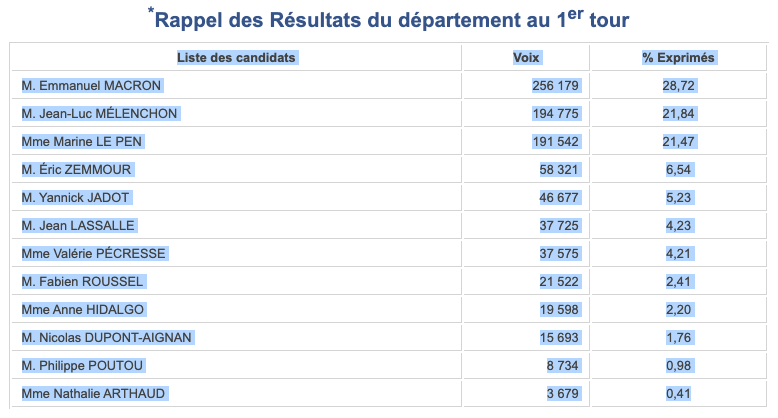]
]

---

### Atelier sur les résultats de l'élection présidentielle de 2022

.pull-left[
- Allez sur http://www.datawrapper.de et cliquez sur "**Start creating**"

- Collez les données copiées précédemment

- Cliquez sur "**Proceed**"

- Cliquez sur "**Add column**"

- Nommez la nouvelle colonne "Parti" et remplissez les cellules de la nouvelle colonne avec le nom des partis politiques

- Cliquez sur "**Proceed**"

]
.pull-right[
.reduite[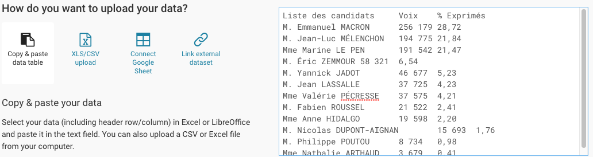]
<br />
.reduite[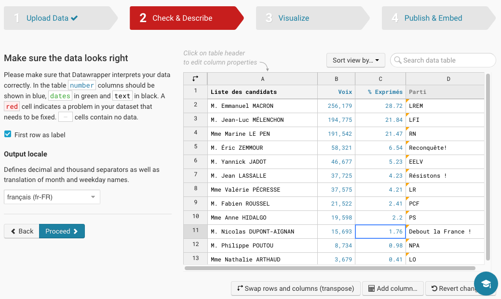]
]

---

### Atelier sur les résultats de l'élection présidentielle de 2022

.pull-left[
- Choisissez le type de visualisation "**Diagramme en barres**". Vous pouvez tester d'autres visualisation si vous voulez.

- Cliquez sur "**Proceed**"

<Br>
<Br>

**Bravo ! Vous avez réalisé votre première visualisation de données avec Datawrapper !**

]
.pull-right[
.reduite[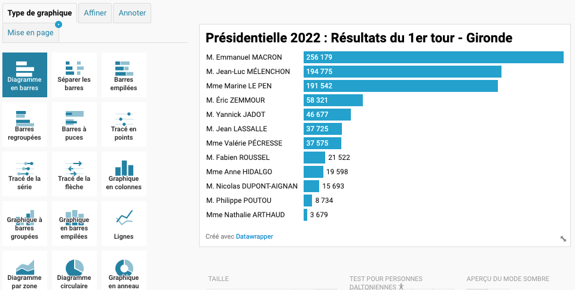]
]

???

Par rapport à Excel, Datawrapper prend en main et montre les étapes à suivre.
---
### .red[Les cartes]

.pull-left[
- **Pour** : des données assignées à des aires géographiques

- **Avantages** : simple à comprendre, joli

- **Règles** :
  1. Simple à réaliser avec des données par pays
  2. Ne visualiser qu’un indicateur par carte ; sinon utiliser des types de représentation différents
]
<Br>
.pull-right[.reduite[]]

---

### Atelier sur les stations Vélib'

.pull-left[
- Allez sur https://www.data.gouv.fr/

- Trouvez le jeu de données "Vélib - Vélos et bornes - Disponibilité temps réel"

- Téléchargez le fichier "Export au format GeoJSON"
]

.pull-right[
.reduite[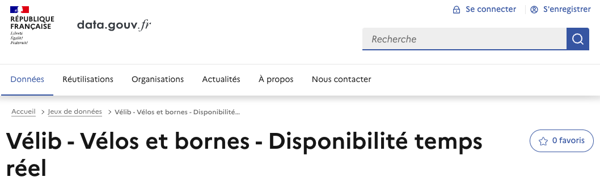]
.reduite[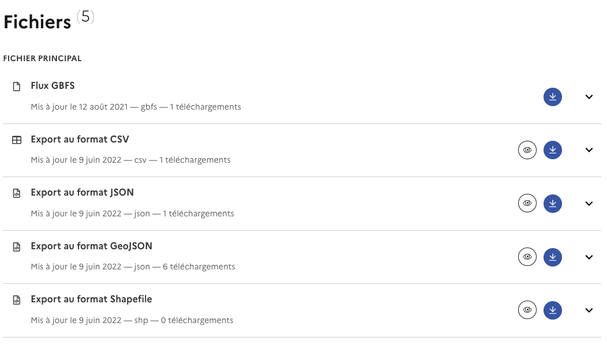]
]


---

### Atelier sur les stations Vélib'

.pull-left[
- Allez sur https://macarte.ign.fr

- Cliquez sur "**Créer ma carte**"

- Sur la barre de droite, cliquez sur "**Accéder à l'outil statistique**" (icône diagramme à barres)

- Cliquez sur "**Charger un fichier**" et aller chercher le fichier .geojson enregistré
]


.pull-right[
.reduite[]
.reduite[]
.reduite[]
]

---

### Atelier sur les stations Vélib'

.pull-left[
- Choisissez le type de carte "**symbole**"

- Choisissez l'attribut "**8-capacity**" pour visualiser la taille des stations Vélib' ; vous pouvez tester d'autres attributs

- Vous pouvez modifier les "**Paramètres**", par ex. pour ajouter une fenêtre popup

- Cliquez sur l'icône "**enregistrer**" pour exporter la carte

**Bravo ! Vous venez de réaliser votre première carte !**
]

.pull-right[
.reduite[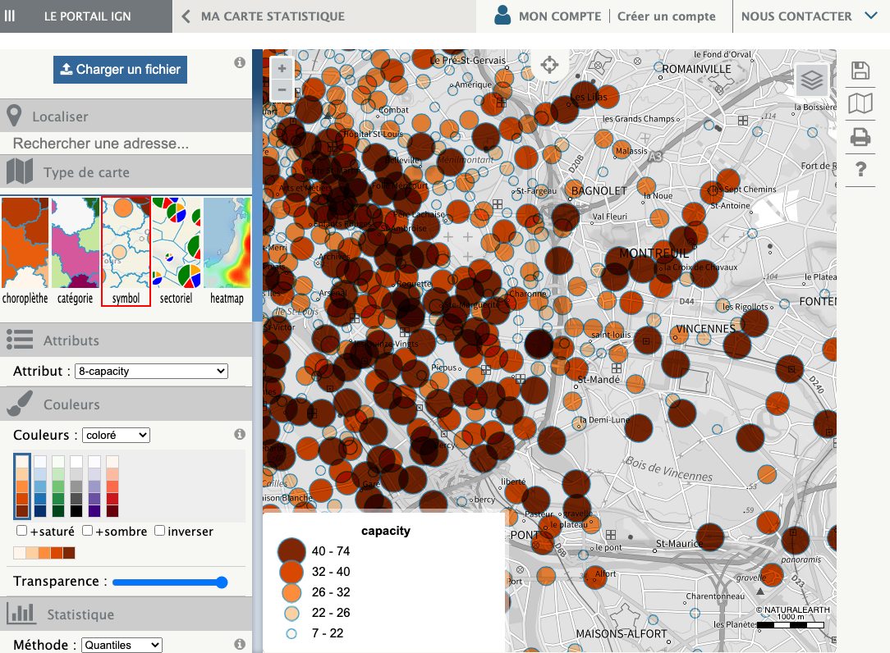]
]

???

Autre exemple de carte avec le Géoportail : https://datactivist.coop/kit_bibliotheque_data/kit/docs/diagnostic-de-lenvironnement.html

---
class: inverse, center, middle

# Merci !

#### Contact : [antoine@datactivist.coop](mailto:antoine@datactivist.coop)

