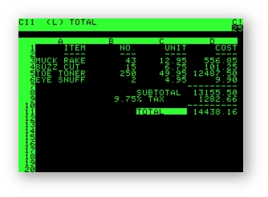
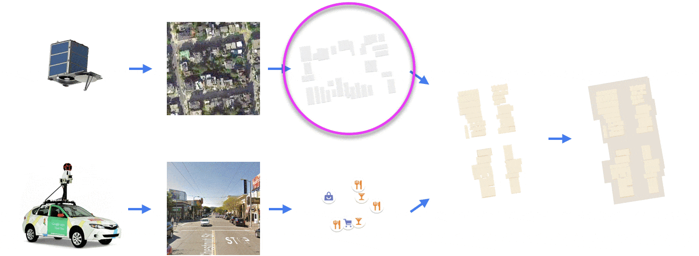
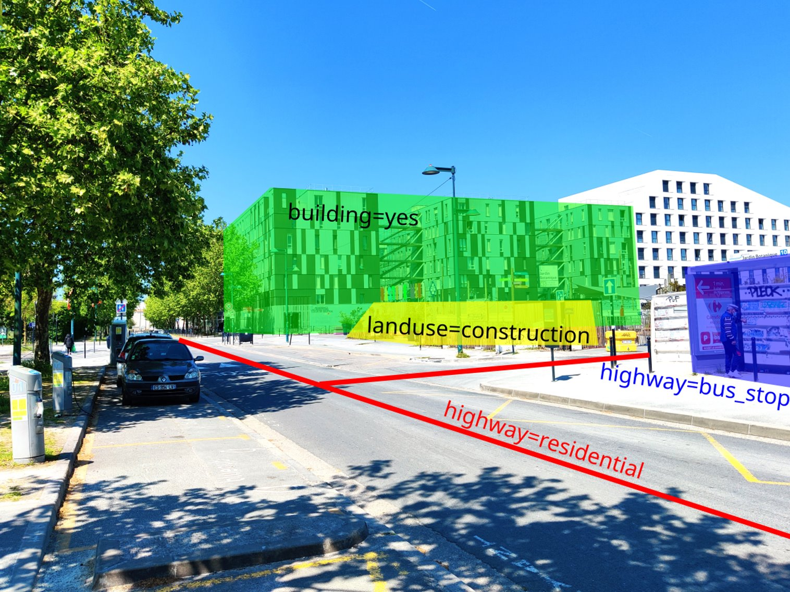
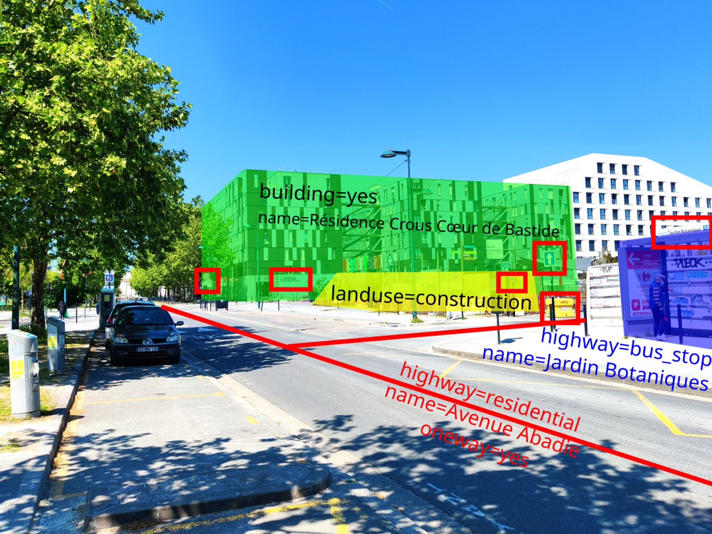
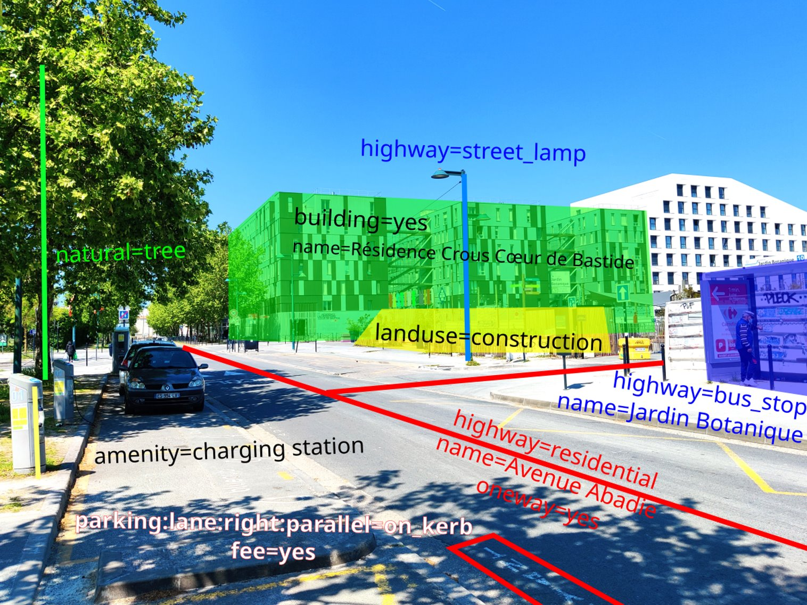
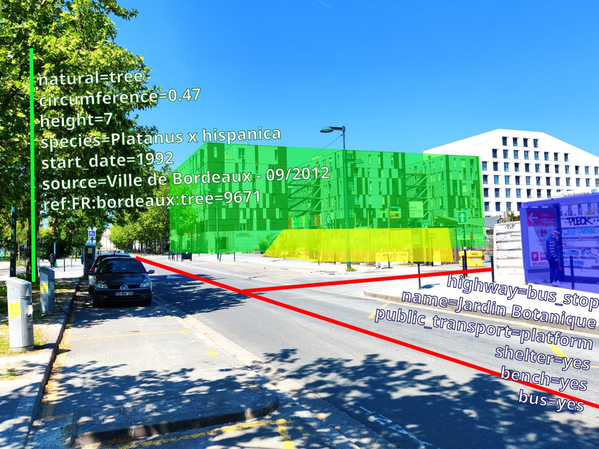
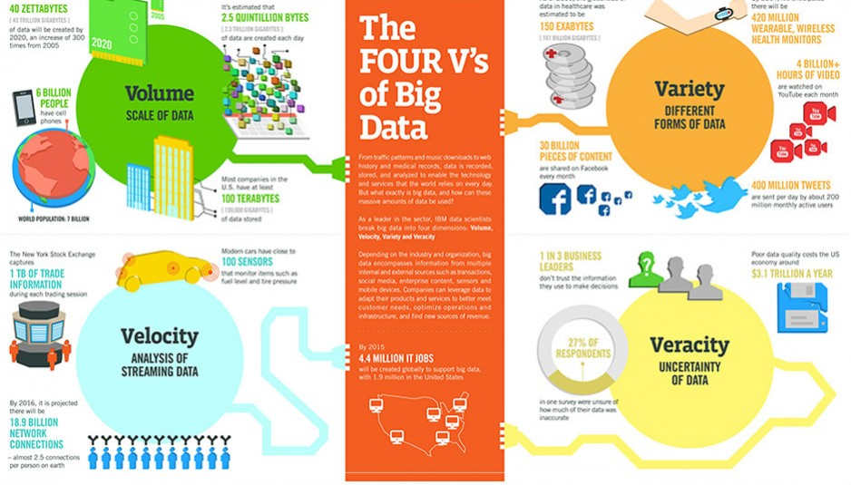
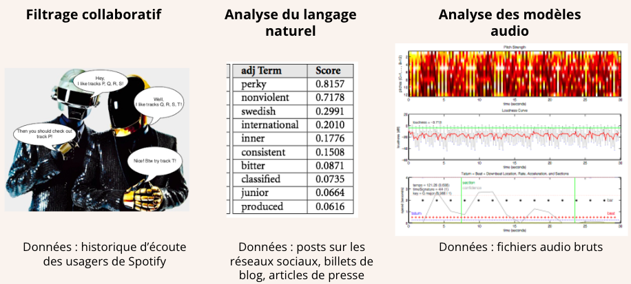
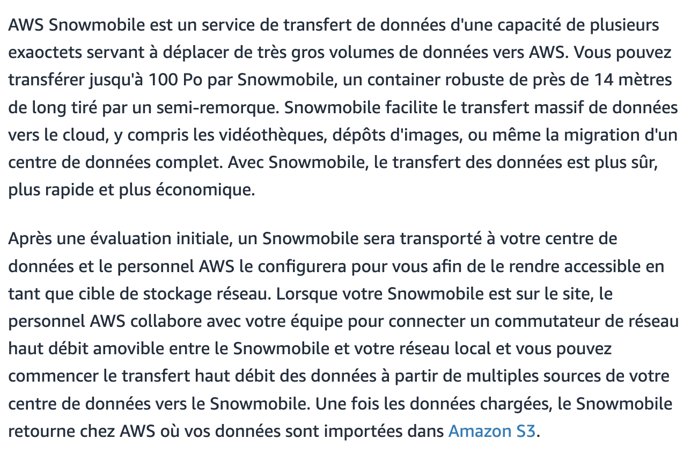

layout: true
  

`r paste0("
", params$event, " 

")` 

---

class: center, middle

Ces slides en ligne : `r paste0("http://datactivist.coop/", params$slug)`

Sources : `r paste0("https://github.com/datactivist/", params$slug)`

Les productions de Datactivist sont librement réutilisables selon les termes de la licence [Creative Commons 4.0 BY-SA](https://creativecommons.org/licenses/by-sa/4.0/legalcode.fr).

 
 

.reduite[]

---
### Objectifs de la séance

* Comprendre ce qu'est une donnée
* Appréhender la mise en données du monde
* Appréhender les types de données existantes
* Comprendre le phénomène *big data* et ses promesses
* Comprendre la science des données, dont la modélisation et le *machine learning*
* Connaître la méthode *data pipeline* développée par School of Data pour la découverte et l'usage de données ouvertes

--

### Autres formations au programme
Voir http://datactivist.coop/oraccle

???

Ouvrez la présentation sur votre poste pour pouvoir suivre les liens

---
class: middle, center

### Avant de commencer

## Présentons nous

.footnote[[Public Domain Review](https://publicdomainreview.org/collection/engravings-from-a-french-ice-skating-manual-1813)]

---
class:center, middle, inverse

# Au fait, c'est quoi une donnée ?
---

### Les données sont partout !

.center[]
.footnote[source : [The Economist](http://lazowska.cs.washington.edu/escience/Economist.big.data.pdf)]

1. Identifiez 3 appareils qui collectent des données

--

2. Identifiez 10 données autour de vous

???

* smartphone, montre connectée, webcam, ordinateur
* étage, numéro de salle, taille des individus, sexe des individus, jauge de la salle, adresse, adresse IP, heure de démarrage, heure de fin (pas la durée qui est une mesure dérivée), volume bouteille d'eau, valeurs étiquettes vêtements, numéro de série téléphone, numéro SS sur carte vitale

/!\ La donnée collectée doit être déjà produite. Les informations déclaratives ne sont pas une donnée, comme “Ce mur est blanc”.

---

### La pyramide de la donnée

Attribuée à [Russell Ackoff](http://en.wikipedia.org/wiki/Russell_L._Ackoff) en 1989, elle signfie que :
.pull-left[

]

.pull-right[

- la **.red[donnée]** est la matière "brute" de l'information conçue plutôt pour des machines
- **.red[l'information]** sont des données qui ont été interprétées pour dégager du sens pour des humains
- en donnant du sens à de l'information, on obtient de la **.red[connaissance]**
- en donnant du sens à la connaissance on obtient de la **.red[sagesse]** (ou compétence.]

---

### Les données, la base de l'informatique

L'informatique consiste dans le traitement de l'information, ou de la donnée. La naissance de l'informatique est le point de départ d'un déluge de données. Le volume des données créées et traitées ne cesse de croitre en même temps que les capacités de calcul des ordinateurs. 

.center[
.reduite2[

]
]

---

### Une définition des données

.left-column[

]
 
.right-column[
 
> *Les données sont généralement comprises comme étant la matière première produite dans l’abstraction du monde en catégories, mesures et autres formes de représentation - nombres, caractères, symboles, images, sons, ondes électromagnétiques, bits - qui constituent les fondations sur lesquelles l’information et le savoir sont créés.*
]

--

.right-column[

]

???

Définition qui mêle le versant conceptuel de la définition (le fait brut) et son versant pratique (codage de l'information).

Autre définition Cnil : "Une donnée correspond à la représentation d'une information sous une forme conventionnelle destinée à faciliter son traitement"

---
class:center, middle, inverse

# L'industrialisation de la production des données

---

### La tablette mésopotamienne : inscrire une réalité complexe
Vers 3200 av. J.-C., en Mésopotamie, la civilisation sumérienne a inventé l’écriture d'abord pour mémoriser des comptes.

.pull-left[

]

.pull-right[
Arbres et têtes de bétails sont classés pour être comptabilisés. On a bien affaire ici à des données.
]
---

### La carte perforée (1884) : le début de la massification des données

Apparue dans les métiers à tisser, la carte perforée contient des informations représentées par la présence ou l'absence de trous dans une position donnée.

.pull-left[
.middle[]
]
.pull-right[
En 1884, Herman Hollerith dépose un brevet pour une machine à cartes perforées destinée à accélérer la production de statistiques pour les gouvernements. Deux ans plus tard, il crée IBM le géant de l'informatique.  
]

.footnote[Vidéo de l'INA (1960) : [La carte perforée](https://www.ina.fr/ina-eclaire-actu/video/caf97059686/la-carte-perforee)]
---

### Les bases de données relationnelles (1970)

Dans les bases de données relationnelles, les données sont inscrites dans des tables et reliées entre elles par un schéma et des clés uniques. Cela permet de traiter de plus grands volumes, de développer des données plus complexes et d'éviter des erreurs de saisie.

.pull-left[
]

.pull-right[
Les bases de données relationnelles facilitent grandement le traitement des données puisqu'elles paraissent à travers une interface utilisateur : « il faut protéger les futurs usagers de grandes banques de données d’avoir à connaitre comment les données sont organisées dans la machine » (Codd 1970).
]

---

### Le tableur (1979) : *data to the people*

En 1979, Dan Bricklin assiste à une conférence à la Harvard Business School et imagine automatiser le calcul de formules d'un modèle financier plutôt qu'effacer et réecrire au tableau à chaque actualisation.

Son logiciel "Visicalc" (« *Visible Calculator* ») .red[démocratise la production des données] en proposant le système de la feuille de calcul sur laquelle les données peuvent être directement manipulées :

.left-column[

]

.right-column[
> "La facilité d’utilisation de Visicalc provenait du fait que l’utilisateur n’avait pas besoin de connaitre de langage de programmation. Sur cet aspect, Visicalc était **l’équivalent du traitement de texte** dans lequel un utilisateur arrange directement l’impression de la page" ([Campbell-Kelly, 2007](http://www.oxfordscholarship.com/view/10.1093/acprof:oso/9780198508410.001.0001/acprof-9780198508410))
]

---

### Le tableur (1979) : *data to the people*

.center[Dan Bricklin et Bob Frankston lancent leur tableur en 1979. Ils racontent :

<iframe width="560" height="315" src="https://www.youtube.com/embed/2a5ex5QlocQ?rel=0" frameborder="0" allow="accelerometer; autoplay; encrypted-media; gyroscope; picture-in-picture" allowfullscreen></iframe>
]

???

Vidéo à montrer jusqu'à 3'05''.
---

### À chaque époque sa technologie

.pull-left[
> *"Les perceptions d'une "surabondance informationnelle" (ou d'un "déluge de données") ont émergé de manière répétée depuis la Renaissance jusqu'aux périodes modernes et, à chaque fois, des technologies spécifiques ont été inventées pour gérer la surabondance perçue."*
]

.footnote[
Strasser, B. J. (2012). "[Data-driven sciences: From wonder cabinets to electronic databases""](http://biologie.unige.ch/assets/brunostrasser//Strasser_SHPSSB_2012.pdf)
]

.pull-right[.reduite2[]]

???

Attention au présentisme

---
class: inverse, center, middle

## Un peu de sémantique

---

### Latin : _dare_ (donner) > _datum_ (donné) > _data_ (donnés)
  
Ce qui est évident, va de soi, est accepté sans discussion.

  
--

> L'existence d'une donnée est indépendante de toute considération de la vérité ontologique correspondante. Lorsqu'un fait s'avère être faux, il cesse d'être un fait. 
Les fausses données n'en restent pas moins des données.

.footnote[[Rosenberg (2013), "Data before the fact"](https://mitpress.mit.edu/books/raw-data-oxymoron)]

???
Un usage connu à partir du 18e siècle. Renvoie à des expériences, des collectes d'éléments.

---
Class:

### Les données brutes sont un oxymore

.pull-left[
> Les données sont toujours "cuisinées" et jamais tout à fait "brutes"

> Les données ont besoin au préalable d'être imaginées comme données pour exister et fonctionner comme telles. L'imagination de ces données implique une base d'interprétation

]
.pull-right[

.footnote[© Xavier Gorce 2018]]

.footnote[[L. Gitelman (2013), *"Raw Data" is an oxymoron", MIT Press](https://mitpress.mit.edu/books/raw-data-oxymoron)]

---

### Data ou capta ?

> Techniquement, ce que nous nous appelons "donnée" est en réalité **"capturé"** (du latin "capere", qui signifie "prendre") ; les *capta* sont les unités de données qui ont été sélectionnées et collectées parmi l'ensemble de toutes les données possibles.

[Kitchin, *The Data Revolution*, 2014](https://books.google.fr/books?hl=fr&lr=&id=GfOICwAAQBAJ&oi=fnd&pg=PP1&dq=kitchin+data+revolution&ots=pcyfMTZh-V&sig=dQyPTL3AIN_4RdWvtBFw4VjdAa4#v=onepage&q=kitchin%20data%20revolution&f=false)

.center[

] 

---

### Données ou obtenues ? 

> Décidément, on ne devrait jamais parler de “données”, mais toujours d’ “obtenues”.

[Bruno Latour, 1993](http://www.bruno-latour.fr/fr/node/255)

> L’enjeu principal, il me semble, une fois que l’on admet que les données sont toujours des « obtenues » comme le disait Bruno Latour lorsqu’il observait le travail quotidien des scientifiques, c’est de comprendre dans quelles conditions elles deviennent malgré tout des « données » pour certains.

Jérôme Denis, 2018 dans un [entretien accordé à Nonfiction](https://www.nonfiction.fr/article-9517-entretien-avec-jerome-denis-a-propos-de-son-livre-le-travail-invisible.htm)

???

Naturalisation des données.

---

### Exemple du recensement en France

.center[
<iframe width="560" height="315" src="https://www.youtube.com/embed/thmNaQl_l1A?rel=0" frameborder="0" allow="accelerometer; autoplay; encrypted-media; gyroscope; picture-in-picture" allowfullscreen></iframe>
]

???

Une mise à jour partielle chaque année, ou complète tous les 5 ans dans les petites communes. 23 000 agents recenseurs. 

---
class: inverse, center, middle

## La mise en données du monde

---
### Le censeur à Rome, ancêtre de la statistique
.center[.reduite3[]]

.footnote[*Asterix chez les pictes*, © Albert René 2013]
---
### Le censeur à Rome, ancêtre de la statistique
.center[.reduite3[]]

.footnote[*Asterix chez les pictes*, © Albert René 2013]
---

### La statistique : outil de gouvernement et de preuve

La statistique est à la fois :
* **outil de gouvernement** (_Statistik_ - 18e siècle)

* **outil de preuve** (_statistics_ - 19e siècle)

--

.left-column.reduite3[

]

.right-column[
> Comment comprendre qu’un même mot, statistique, évoque pour les uns la simple quantification (…), et pour d’autres l’idée de grands nombres et de régularités tendancielles appuyées sur le calcul des probabilités (…) ?
]

???

La Statistik allemande du 18e siècle était une description organisée de l’État, descriptive, peu quantitative, rassemblant les savoirs utiles au Prince.

La statistique inférentielle est une branche spécialisée des mathématiques, utilisée pour induire, tester et généraliser des connaissances à partir de faits observés (calcul des probabilités, phénomènes aléatoires ou stochastiques…).

Avant le 19e siècle, la légitimité sociale des statisticiens ne provient donc pas de méthodologies formelles encore inexistantes mais de leur capacité à s’insérer dans des projets socio-politiques plus vastes en s’y affirmant comme des points de passage obligés.

---
  
### Quantifier, c'est convenir puis mesurer

.center[
<iframe width="560" height="315" src="https://www.youtube.com/embed/k2CejlPnqsQ?rel=0" frameborder="0" allow="accelerometer; autoplay; encrypted-media; gyroscope; picture-in-picture" allowfullscreen></iframe>
]

???

Exemple de convention : le kilo

Vidéo jusqu'à 5'38''
 
---
### Quantifier, c'est inscrire et figer une réalité sans cesse mouvante

.center[.reduite3[]]

.footnote[*Asterix chez les pictes*, © Albert René 2013]

---
### Quantifier, c'est inscrire et figer une réalité sans cesse mouvante

.center[.reduite3[]]

.footnote[*Asterix chez les pictes*, © Albert René 2013]

---
### "Datafication" : la mise en données du monde
> "L'immense gisement de données numériques découle de la capacité à paramétrer des aspects du monde et de la vie humaine qui n'avaient encore jamais été quantifiés. On peut qualifier ce processus de **« mise en données » (datafication)**. 

> (…) La mise en données désigne autre chose que la numérisation, laquelle consiste à traduire un contenu analogique - texte, film, photographie - en une séquence de 1 et de 0 lisible par un ordinateur. Elle se réfère à une action bien plus vaste, et aux implications encore insoupçonnées : **numériser non plus des documents, mais tous les aspects de la vie**."

.footnote[Kenneth Cukier (2013), "[Mise en données du monde, le déluge numérique](https://www.monde-diplomatique.fr/2013/07/CUKIER/49318)", *Le Monde diplomatique*]

---

## La "nombrification" du monde

.left-column[

]

.right-column[
> La numérisation ne serait pas survenue sans une "nombrification" préalable qui consiste à quantifier de plus en plus d'aspects de notre expérience du réel.

> **Au commencement était le verbe, il semble à la fin que tout devient nombre.**

> Personne ne saurait parler sérieusement de l'état de la société et discuter politique sans se référer aux informations quantitatives.
]

???

Olivier Rey, mathématicien et philosophe, chercheur au CNRS à l'Institut d'histoire et de philosophie des sciences et des techniques : "Quand le monde s'est fait nombre" (2016)

Exemple du débat à la présidentielle 2022

---
Class: middle, center

## La mise en données du monde

- **Concrètement, aujourd'hui, quels aspects de votre vie sont mis en données ?**

--

- Recherches internet, pratiques sportives, consommation énergie, régime alimentaire, trajets dans les transports en commun...

- Cette mise en donnée est rendue possible par le développement de .red[**capteurs**] qui viennent collecter et agréger ces données.

--

- Recherches internet .red[(cookies)], pratiques sportives .red[(montres connectées)], consommation énergie .red[(compteurs connectés)], régime alimentaire .red[(appli type Yuka)], trajets dans les transports en commun .red[(Pass Navigo)]...

- La question devient peut-être, *quels aspects de votre vie ne sont pas (encore) mis en données ?*

???

Faire une recopie d'écran de l'iPhone pour montrer l'app Santé.

---
### Exemple : les données de bornage des téléphones

---
### Le nouveau positivisme des données

> Nous sommes maintenant en mesure de collecter d'énormes quantités de données. Cette capacité semble comporter certaines hypothèses culturelles - à savoir que **tout ce qui peut être mesuré doit être mesuré; que les données constituent un filtre transparent et fiable nous permettant de mettre côté les émotions et l'idéologie** ; ou encore que les données nous aideront à faire des choses remarquables - comme prédire l'avenir

David Brooks, éditorialiste du New York Times, ["The Philosophy of Data"](https://www.nytimes.com/2013/02/05/opinion/brooks-the-philosophy-of-data.html) (2013)

.center[]

---
### Le nouveau positivisme des données

- Attention, les données, même provenant de sources officielles, ne sont pas pour autant neutres, irréprochables ou porteuses de "LA" vérité

.center[]
.footnote[Dilbert © Scott Adams]

- **Avez-vous des exemples de données officielles pouvant faire l'objet de critiques ?**
--

- Délinquance, immigration, SDF...

---

### Exemple : les données de la déliquance

.center.middle[
<iframe width="560" height="315" src="https://www.youtube.com/embed/bMZ4YVrIY_s?rel=0" frameborder="0" allow="accelerometer; autoplay; encrypted-media; gyroscope; picture-in-picture" allowfullscreen></iframe>
]

???

Vidéo jusqu'à 4'28''. L'Etat 4001 est une convention.

---

class:center, middle, inverse
# Données, données... quelles données ?

---

### Données quantitatives

* données représentant une quantité ou une fourchette

* données généralement associées à une unité de mesure

* données bornées (par exemple > 0)

* on peut généralement leur appliquer des opérations arithmétiques (somme, moyenne…)

On parle aussi de **données concernant des variables quantitatives ou numériques**.

.center.reduite3[

]

???

une somme peut ne pas avoir de sens sur certaines grandeurs physiques

source : dictionnaire de l'OCDE https://stats.oecd.org/glossary/detail.asp?ID=2219 

---

### Données qualitatives

* données classant les attributs d'un objet (ex. : sexe, catégorie socio-professionnelle)

* les classes pouvent être codées par une valeur numérique arbitraire, qui ne signifie rien (ex. : 1 pour homme et 2 pour femme)

---

### Données non structurées

* données non numériques (texte, image, vidéo, son, musique…)

* peuvent être réduites en diverses données quantitatives ou qualitatives, avec perte d'information

 

.center[

]

???

par exemple la fréquence en BPM, la durée… d'un morceau de musique

---

### Exemple de réduction de données non structurées

Les annotations en fouille de texte (*text mining*)

.reduite[]

???

réduction en données qualitatives

---
### Exemple : la grande annotation

???

montrer les trois exemples pour cliquer sur "Lire et annoter des réponses"

---

### Données structurées

.pull-left[
Des données dotées d'un modèle qui définit les relations entre composants

  + Ex : base de données relationnelle SQL
  
  + Faciles à analyser, manipuler, visualiser...
]
.pull-right[

]

---

### Données capturées, échappées, transitoires 

** Données capturées**

Observation, enquête, expérimentation, prise de notes, senseurs... dont l'intention première est de générer des données.

--

** Données échappées**

Sous-produit d'un engin ou d'un système dont la fonction première est autre.

--

** Données transitoires**

Données échappées qui ne sont jamais examinées, transformées ou analysées.

???

Exemples de données échappées : parking, portiques des bibliothèques, recherches Google (Google Trends et Google Flu), logs de connexion... et beaucoup de données administratives ouvertes !

---
### Données dérivées

Résultat d'un traitement ou une analyse supplémentaire de données capturées. 

Exemple avec les données de Google Maps :

---

### Index, attributs, métadonnées

**Index**

Variable permettent l'identification et la mise en relation (donnée pivot). Essentiel pour enrichir les données. Exemple : SIRET. 

--

**Attributs**

Données représentent les aspects d'un phénomène, mais ne sont pas des index (pas identifiants uniques).

--

**Métadonnées**

Données sur les données. Peuvent être descriptives, structurelles ou administratives. Exemple de standard : le [Dublin Core](https://fr.wikipedia.org/wiki/Dublin_Core). 

---

### Les données crowdsourcées

Des données produites par des citoyens, qui sont éventuellement des communs partagés et gouvernés par leurs producteurs.

**Connaissez-vous un site ou une application fonctionnant via des données crowdsourcées ?**

--

Exemple : OpenStreetMap, le wiki de la carte

.center.reduite3[

]

---

### Exemple : OpenStreetMap

.center.reduite[

]

.footnote[CC-BY Frédéric Rodrigo]

---

.footnote[CC-BY Frédéric Rodrigo]

---

.footnote[CC-BY Frédéric Rodrigo]
---

.footnote[CC-BY Frédéric Rodrigo]

---
class:inverse, middle, center
# Big data

---

### Les 4 V du Big data

.footnote[© IBM]
---

### De plus en plus de données

 |  | 

En deux jours, l’humanité produit autant d'information que ce qu'elle a produit depuis la naissance de l'écriture jusqu’en 2003.

---

### L'obsession du volume de données

.pull-left[
**Quelques chiffres omniprésents** : 
- le volume de données produit double tous les 3 ans (Gantz & Reisel 2011)
- 90% des données créées dans les deux dernières années (IBM 2012)
- 40% : croissance annuelle de la production de données (Maniyka et al. 2011) 
]
.pull-right[
**Problèmes de cette approche** : 
- Estimations guidées par des intérêts commerciaux
- Ne définit pas ce que sont ces données
- Résume le big data au Volume
- Explique mal la mise en données du monde
]

---

### Exemple : Spotify

.footnote[
Sophia Ciocca (2017), "[How does Spotify know you so well?](https://medium.com/s/story/spotifys-discover-weekly-how-machine-learning-finds-your-new-music-19a41ab76efe)"
]

???

L'analyse du spectre audio permet notamment de prendre en compte les nouvelles chansons.
---

### Les promesses du big data

--

.left-column[

]

.right-column[
- .red[**Mieux gouverner**] (*governing people*) : dans la continuité de la tradition statistique de l'État, améliorer le service rendu au public, prévenir les crimes et délits…

- .red[**Gérer les organisations**] (*managing organisations*) : améliorer le fonctionnement des CRM, ERP… pour plus de productivité

- .red[**Accroître la valeur**] (*leveraging value and producing capital*) : micro-ciblage marketing, optimisation des magasins et des opérations, efficience logistique…

- .red[**Améliorer les lieux de vie**] (*creating better places*) : gouverner les villes avec des données (*smart city*) 

- .red[**Révolutionner la science**] (*reframing science*) : un nouveau paradigme guidé par les corrélations, débarrassé de la théorie
]

???

Selon vous, à quoi peut servir le big data ?

Rob Kitchin (2014) résume les promesses du big data.

---

### Les promesses du big data

.center[

]

---

### La méthode scientifique évolue avec les données

- branche 1 (déductive) : mathématiques, logique

- branche 2 (empirique) : analyse statistique, inductive, d'expériences avec groupe témoin

- **branche 3 (computationnelle)** : simulation à grande échelle utilisant les données

.footnote[
Victoria Stodden (2010), "[The Digitization of Science and the Degradation of the Scientific Method](https://www.ischool.berkeley.edu/sites/default/files/VictoriaStoddenBIS2010.pdf)", UC Berkeley School of Information Dean's Lecture
]

---

### La fin de la théorie ?

> Nous pouvons désormais analyser les données sans faire d'hypothèses sur ce qu’elles vont montrer. Nous pouvons jeter les nombres dans le plus grand réseau d’ordinateurs que le monde ait jamais vu et laisser les algorithmes trouver les modèles que la science n’arrivait pas à trouver.  
> — Chris Anderson, journaliste *Wired Magazine*

 

--

> L’analyse des données est extrêmement utile, mais sa disponibilité croissante risque d’avoir l’effet exactement inverse de celui prédit par Anderson : une floraison de théories. Parce qu’il n’y a pas d’autres façons d’imaginer ce que l’on ne peut pas voir – ce qui constitue le problème principal de la science.  
> — Alexandre Delaigue, PRAG économie-gestion à l'Université Lille 1

.footnote[
Hubert Guillaud (2011), ["Big Data : est-ce que le déluge de données va rendre la méthode scientifique obsolète ?"](http://internetactu.blog.lemonde.fr/2011/09/30/big-data-est-ce-que-le-deluge-de-donnees-va-rendre-la-methode-scientifique-obsolete/), InternetActu
]

???

Un débat toujours pas tranché

---

## Linked data

- poussé par le W3C et Tim Berners-Lee
- sémantique / web des données
- S'appuyer sur des formats ouverts : RDF / SPARQL
- Wikidata comme données pivot

.center.reduite3[

]

---

## API

.pull-left[
- Application programming interface

- les machines parlent aux machines

- donnée dynamique => ouverture potentiellement limitée et contrôlée 

- exemple : [api.gouv.fr](https://api.gouv.fr/rechercher-api)]
.pull-right[

]

---
class:inverse, middle, center

## Qu'est-ce que la data science ?

---

### Le risque : confondre corrélation et causalité

Deux événements (appelons les X et Y) sont corrélés si l’on observe une relation entre les deux. Une erreur de raisonnement courante consiste à dire : « X et Y sont corrélés, donc X cause Y ». On .red[confond corrélation et causalité].

--

**L'effet cigogne** désigne la tendance à confondre corrélation et causalité.

.left-column.reduite[

]

.right-column[
> Dans les communes qui abritent des cigognes, le taux de natalité est plus élevé que dans l’ensemble du pays. Conclusion : les cigognes apportent les bébés ! En fait, les cigognes nichent de préférence dans les villages où la natalité est plus forte en milieu rural que dans les villes.
]

.footnote[Source : [CORTECS](https://cortecs.org/materiel/effets-cigogne-correlation-vs-causalite/)]

---

### Vous aussi, générez des corrélations absurdes

.center[
L'équipe des Décodeurs du *Monde* a produit un [générateur de comparaisons absurdes et parfois drôles](https://www.lemonde.fr/les-decodeurs/article/2019/01/02/correlation-ou-causalite-brillez-en-societe-avec-notre-generateur-aleatoire-de-comparaisons-absurdes_5404286_4355770.html), essayez le !

]

---

### Data science : les nouvelles statistiques ?

> Je continue à dire que le travail sexy dans les dix prochaines années sera celui de statisticien. Les gens pensent que je plaisante, mais qui aurait deviné que les ingénieurs en informatique auraient été le métier sexy des années 1990 ?

Hal Varian (Chief economist, Google), *The McKinsey Quarterly*, Janvier 2009

 
> Je pense que *data scientist* est un terme glamour pour désigner un statisticien.

Nate Silver (2013), "[What I need from statisticians]"(https://www.statisticsviews.com/article/nate-silver-what-i-need-from-statisticians/), *Stats & data science views*

---

### Data science : les nouvelles statistiques ?

.center.reduite[

]

???

le ML est déjà de la data science mais elle ne sera pas utile (et pourra réinventer la roue) si elle ne sait pas quels problèmes résoudre et comment 

La data science, comparativement à la statistique "traditionnelle", est un métier de praticien, presque de bidouilleur : elle nécessite des compétences mathématiques et statistiques, certes, mais aussi une compétence "métier" (compréhension du domaine d'application) et une solide maîtrise de l'informatique.

---
### Développement de la puissance de calcul

???

Fréquence d'horloge en MHz ; nombre d'opérations par seconde en FLOPS
---

### Développement de la capacité de stockage

???

En 1996

---

### Développement de la capacité de stockage

.right-column[

]

.left-column[

]

???

En 2016

---

### Développement de la capacité de stockage

> The Atacama Millimeter/submillimeter Array (ALMA) in Chile went live this week. Some of its first projects include examining black holes. The data generated will be so large that it is faster to physically fly the datasets from Chile to MIT or Bonn than to transmit the data electronically.

---
Class: middle
## Que fait-on une fois qu'on a des données ?

### Modélisation

- Un modèle réduit de la réalité pour analyser, expliquer ou prédire

Modéliser, c’est mettre en relation une *variable expliquée*
(dépendante / prédite) et une ou plusieurs *variables explicatives*
(indépendantes / prédicteurs).

**Tous les modèles sont faux, certains sont utiles**

---
### Pourquoi modéliser ?

.reduite[.center[]]

???

Identifier des corrélations, même si on ne sait pas les expliquer.

---

### Pourquoi modéliser ? Les "deux cultures"

- pour analyser et expliquer (**statistiques classiques, économétrie**)

- pour prédire (**machine learning, IA...**)

.footnote[
Leo Breiman (2001), "[Statistical Modeling: The two cultures](https://projecteuclid.org/download/pdf_1/euclid.ss/1009213726)", *Statistical Science*
]

---
## Et le machine learning alors ?

- Fondamentalement, modélisation et machine learning se ressemblent du point de vue du statisticien : trouver la relation entre une variable expliquée et des variables explicatives

- une différence cruciale : veut-on prévoir ou comprendre/analyser ?

- en pratique : le machine learning porte sur des données plus complexes que la modélisation traditionnelle, avec beaucoup de valeurs manquantes 

---

### Apprentissage supervisé

Jouons avec [Teachable Machine](https://teachablemachine.withgoogle.com) (Google)

.center[
<video src="./img/prediction.mp4" autoplay="" muted="" width="370" height="336" type="video/mp4"></video>
]

???

Apprentissage supervisé : il faut définir les classes a priori et y classer des données d'entraînement

---

### Apprentissage non supervisé

.center[

]

.footnote[
David Sheehan (2017), "[Clustering with Scikit with GIFs](https://dashee87.github.io/data%20science/general/Clustering-with-Scikit-with-GIFs/)"
]

---
class: center, middle, inverse

# Le data pipeline

---

## Le pipeline de données

---
## Vérifier les données

---
## Vérifier les données

---
## Nettoyer les données

Paradigme du [_tidy data_](http://vita.had.co.nz/papers/tidy-data.pdf) (Hadley Wickham)

> “Les familles heureuses sont toutes pareilles; chaque famille malheureuse est malheureuse à sa manière.” – Leon Tolstoï 

> “Les jeux de données ordonnés se ressemblent tous, mais chaque jeu de données désordonné est désordonné à sa manière
.” – Hadley Wickham

--

**Principes du *tidy data* ("données ordonnées")**
- Chaque variable correspond à une colonne
- Chaque observation/individu correspond à une ligne
- Chaque type d'unité d'observation correspond à une table
- Chaque cellule comporte une donnée 

---
# Analyser et modéliser les données

C'est le cœur de la data science... et souvent le plus rapide, paradoxalement. 

---
# Visualiser les données
### Choisir un format de visualisation

.center[.reduite[]]

---
# Visualiser les données
### Trouver un outil
.reduite[]

---
class: inverse, center, middle

# Merci !

Contact : [joel@datactivist.coop](mailto:joel@datactivist.coop)