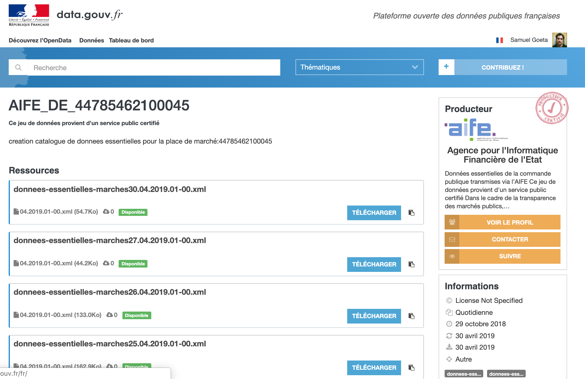
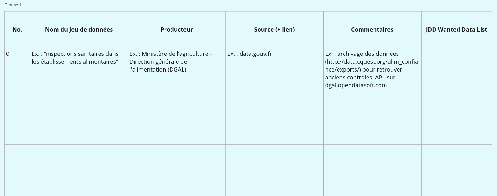

layout: true

`r paste0("
", params$event, " 

")` 

---

class: center, middle

Ces slides en ligne : `r paste0("http://datactivist.coop/", params$slug)`

Sources : `r paste0("https://github.com/datactivist/", params$slug)`

Les productions de Datactivist sont librement réutilisables selon les termes de la licence [Creative Commons 4.0 BY-SA](https://creativecommons.org/licenses/by-sa/4.0/legalcode.fr).

   

---

### We .red[open data], we make them .red[useful]

.reduite.center[]
---

### Résultats attendus

-   "Wanted Data List" listant les données nécessaires au projet
-   Recensement et évaluation des jeux de données ouverts ou disponibles en interne
-   "Plan de route données" pour déterminer la meilleure stratégie permettant d'obtenir les jeux de données souhaités, et les prochaines actions à mener

--

### Autres formations au programme

Voir <http://datactivist.coop/oraccle>

---

### Programme de la journée

.reduite.center[]

---

### Au programme de l'introduction

* Présentation de la méthodologie
* Rappels : qu'est-ce qu'une donnée ? un jeu de donnée ?
* La réutilisation des données : un parcours du combattant
* Intervention de Pierre Boudes : les objectifs d'ORACCLE

---
class:inverse, middle, center

## La réutilisation des données : un parcours du combattant

---

### Obstacle 1 : la .red[découvrabilité]

.pull-left[ A l'heure actuelle, les données sont très difficiles car généralement : 
* les moteurs de recherche des portails fonctionnent mal] 

.pull-right[] 

---

### Obstacle 2 : la .red[documentation]

Sur 12 villes en France, une [étude de Datactivist (2018)](https://medium.com/datactivist/qui-a-ouvert-quoi-le-recensement-des-données-des-villes-est-maintenant-ouvert-b7f697135c1f) a montré que : 
* la moitié des descriptions des jeux de données faisait moins de 180 caractères (soit un peu moins de la longueur d'un tweet)
* 4% des jeux de données ont une description supérieure à 1000 caractères soit moins d'une demi-page.

 

.reduite[]

---
### Un exemple de données .red[introuvables]
Ce jeu de données contient plus de 6000 marchés publics attribués par l'Etat. Mais, malgré mon [signalement](https://www.data.gouv.fr/fr/datasets/aife-de-44785462100045/#discussion-5c5d2857634f41019657c80d-0), tout est fait pour le rendre introuvable !

[.reduite[]](https://www.data.gouv.fr/fr/datasets/aife-de-44785462100045/)
---

### Obstacle 3 : la .red[qualité] des données

Enfin, le troisième obstacle porte sur la **qualité** des données.

Le rapport de [l'Open Data Barometer](https://opendatabarometer.org/4thedition/report/) signale que : 

> "les données des gouvernements sont souvent incomplètes, pas actualisées, de mauvaise qualité et fragmentaires" et

> "de manière générale, la gestion et la publication des données ouvertes sont fragiles et sujettes à des erreurs multiples."

⚠ la qualité des données ne dépend que de l'usage qui en est fait.

La documentation est indispensable pour que le public parvienne à saisir les usages précédents des données et les adapte à de nouveaux usages, souvent inconnus de celles et ceux qui les produisent.

---
### Un exemple de données inutilisables

---

### Un autre exemple de données inutilisables

---
### Des .red[opportunités manquées] pour les porteurs de projets

Nombreux sont les porteurs de projet à passer à côté des données du fait des problèmes évoqués précédemment…

--

Pourtant, les données peuvent potentiellement **décupler l’impact d’un projet** et **disposer d’avantages comparatifs décisifs** en : 
* offrant de nouvelles opportunités de création de services
* proposant de nouveaux éclairages sur les phénomènes étudiés 
* en accélérant des processus métier peu optimisés.

--

**Besoin de médiation** pour aider à : 
* trouver les bonnes données
* demander des données manquantes (cf [madada.fr](madada.fr))
* "scrapper" ou extraire par API des données en ligne
* …et parfois acheter des données 
---

### Des .red[échanges trop rares] entre producteurs et réutilisateurs de données

Du côté des acteurs publics, indispensable que les données mises à disposition trouvent un public qui les réutilise pour **valoriser des cas d'usage** qui justifient le travail investi.

Or, les **espaces d'échange** et de dialogue entre producteurs et réutilisateurs de données sont encore rares mais essentiels pour fluidifier les frictions de la réutilisation.

---

class:inverse, middle, center

## Notre méthdologie

---

### Notre méthodologie : le [parcours d’évaluation du potentiel data](https://infolabs.io/pes)

* Conçu par la FING dans le cadre de la campagne Infolab et enrichi par Simon Chignard. 

* Une méthodologie française documentée, “open source” qui est déjà utilisée en entreprise auprès du groupe UP. 

* Evaluer le potentiel des données (notamment ouvertes) pour un projet en minimum une journée et peut être décomposé en deux ou trois sessions. 

* Ne requiert aucune connaissance technique et s’adapte à tout type de projet

* Débouche sur un **“plan de route données”**, un plan d’action permettant d’intégrer au projet les données utiles selon deux critères : le fort impact sur le projet et l’accessibilité des données.  
---

### Phase 1 : .red["Wanted Data List"], comprendre les besoins data du projet

--\> la liste idéale des données à mobiliser pour le projet. C'est une manière de prendre pied avec le sujet.

**Décrire les jeux de données de la manière la plus simple**, sans a priori ni référence à un jeu ou un fournisseur de données particulier : c'est la nature des données qui nous intéresse. Par exemple :

-   OK : sens de circulation des rues de Marseille.
-   KO : SIG de la ville de Marseille (ça ne nous dit pas quelle donnée vous intéresse et ne permet donc pas de savoir si elle n'est pas plus accessible ailleurs).

---
### Un exemple de "Wanted Data List"

---

### Phase 2 : la collecte et .red[l'évaluation des données]

Il nous fait maintenant trouver de vrais jeux de données correspondants à travers une phase de **collecte des données**.

---
### [Conseil] Utiliser les .red[opérateurs spéciaux]

Exemple avec la requête "site:education.gouv.fr filetype:xlsx" :

---

### [Conseil] Utiliser les .red[facettes] pour trouver les bonnes données

.pull-left[ ]

.pull-right[ Les facettes sont des filtres dans les métadonnées. ]

---

### [Conseil] Utiliser .red[Google Dataset Search]

Google propose depuis quelques temps ce [moteur de recherche](https://toolbox.google.com/datasetsearch) aggrégant de très nombreux portails open data. Les résultats sont inégaux mais le moteur est encore nouveau...

---
### [Conseil] Chercher dans le [réseau de données OpenDataSoft](data.opendatasoft.com)
OpenDataSoft référence tous les jeux de données publiés sur l'ensemble de ses portails. Parmi eux, le portail Public référence des jeux de données introuvables ailleurs comme la [localisation des radars](https://data.opendatasoft.com/explore/dataset/radars%40public/table/). 

---

### [Conseil] Trouver le bon .red[tag] sur OSM

La page "[Elements Cartographiques](https://wiki.openstreetmap.org/wiki/FR:%C3%89l%C3%A9ments_cartographiques)" sur le wiki d'OSM recense tous les tags utilisés dans la base de données.

 .footnote[Plus d'infos : <https://datactivist.coop/atelier-osm/>]

---
### [Conseil] Utiliser le [forum #TeamOpenData](https://teamopendata.org/)

Ici une question concernant les données sur la pollution sonore.

---

### [Conseil] Rechercher les principaux .red[portails open data] du secteur en question

Pour notre cas, il peut en exister plusieurs : 
* [Site open data du Ministère de l'enseignement supérieur et de la recherche](https://data.enseignementsup-recherche.gouv.fr/pages/home/?flg=fr)

* [DataESR](https://data.esr.gouv.fr/FR/)

* [data.education](https://data.education.gouv.fr/pages/accueil/)

* ... et d'autres ?

.red[Attention] : tous ne seront pas utiles. N'hésitez pas à partager vos conseils aux autres !

---

### Phase 2 : .red[L'évaluation] des données

Chaque jeu de données listé dans le catalogue fait l'objet d'une évaluation à travers la "Dataset check list"

---

### Phase 3 : le .red[plan de route] data

La cartographie des données réalisée à l’étape précédente est un outil pour préparer le plan de route données du projet. 5 options en matière de **sourcing des données**: 

1. **Sécuriser** : s’assurer qu’une donnée critique pour le projet ne sera pas dégradée ou que sa fourniture ne sera pas interrompue,
2. **Augmenter** : investir dans l’amélioration d’une donnée, sa qualité ou son niveau de détails,
3. **Collecter** : mettre un place de collecte pour récupérer des données utiles pour le projet mais pas ou peu disponibles - on peut étudier l’intérêt du crowdsourcing,
4. **Nouer des partenariats** : établir des accords avec des tiers pour accéder à leurs données, ou faire de l’échange de donnée entre partenaires,
5. **Acheter** : identifier des sociétés (courtiers en données) qui pourraient vendre les données qui nous manquent.

Ensuite, vous devrez **identifier 10 actions à réaliser maintenant / dans les 3 prochains mois / au cours de la prochaine année.**

---

### Une formation mais productive grâce à .... la .red[documentation] de vos projets

.pull-left[Faites les activités sur Miro ensemble : ]

.pull-right[Documentez en ligne ensuite : ]

---

class: inverse, center, middle

# Merci !

Contact : [clement@datactivist.coop](mailto:clement@datactivist.coop)