layout: true
  

`r paste0("
", params$event, " 

")` 

---

class: center, middle

Ces slides en ligne : `r paste0("http://datactivist.coop/", params$slug)`

Sources : `r paste0("https://github.com/datactivist/", params$slug)`

Les productions de Datactivist sont librement réutilisables selon les termes de la licence [Creative Commons 4.0 BY-SA](https://creativecommons.org/licenses/by-sa/4.0/legalcode.fr).

 
 

.reduite[]

???

Vous pourrez y accéder dans un instant.

---

### We .red[open data], we make them .red[useful]

.reduite.center[]

---
## Qui sommes nous ?

- Datactivist est un .red[**pure player de l’open data**] créé en 2016, par Samuel Goëta et Joël Gombin.

- Se positionnant sur .red[**toutes les étapes du travail d’ouverture des données**], Datactivist travaille tant avec les producteurs de données qu’avec les réutilisateurs et participe à l’appropriation des données par chacun.

- Nous appliquons nos propres .red[**valeurs**] : nous sommes une coopérative ; nos supports de formation et nos contenus sont librement réutilisables, publiés en licence Creative Commons.

- Une approche issue de la recherche : voir notamment **https://datactivist.coop/these**. 

- Nous animons la communauté [#TeamOpenData](https://teamopendata.org).

---
## Nos activités

- Conseil sur les .red[**stratégies d’ouverture de données**] : nous aidons les organisations dans la conception et la mise en œuvre de leur stratégie d’ouverture de données.

- .red[**Accompagnement dans la réutilisation de données ouvertes**] : nous aidons les organisations à utiliser les données au quotidien. 

- .red[**Sensibilisation et formation à la donnée**] : nous formons à la culture générale des données, nous enseignons les grands principes et bonnes pratiques de l'open data et nous introduisons à la data science. 

- .red[**Médiation de données**] : nous organisons des hackathons, des open data camps, des expéditions de données...

???

La médiation de données est aussi fondamentalement une animation de communauté(s). 

---
## Notre vision

### D'un open data de l'offre à un .red[open data de la demande]

Aujourd’hui, les administrations choisissent les données à ouvrir, elles décident du quand et du comment .red[**sans consulter les usagers**].

Les rares données ouvertes sont souvent décevantes : pas à jour, trop agrégées, mal documentées, mal formatées, parfois inutilisables. 

Il faut aujourd’hui passer à l’étape supérieure : .red[**un open data piloté par la demande**].

Mais c'est difficile : demande peu visible, pas de possibilité de soumettre la communication des données à l'expression d'une demande. Leviers : demandes d'ouverture, plateformes, animations (ex : hackathon), gouvernance partagée... 

---
### Objectifs de la séance

* Connaître les huit étapes de l’open data pipeline

* Savoir illustrer chaque étape par des exemples concrets

* Savoir identifier les objectifs, les enjeux, et les rôles impliqués à chaque étape

--

### Autres formations au programme
Voir http://datactivist.coop/oraccle

???

Ouvrez la présentation sur votre poste pour pouvoir suivre les liens

---
class: middle, center

### Avant de commencer

## Présentons nous

.footnote[[Public Domain Review](https://publicdomainreview.org/collection/engravings-from-a-french-ice-skating-manual-1813)]

---
### Open data pipeline : les principales étapes de l'ouverture

.reduite.center[

]

---
### .red[Identifier]

#### Explorer l'organisation à la recherche de données "ouvrables"

.pull-left[

]

--

.pull-right[
**Quels acteurs clés ?**

**Missions :**
* Rencontrer les agents

* Cartographier les données

* Documenter les données
]

???
Acteurs clés :
* Chef de projet open data
* Référents open data
* Producteurs de données

---
### L’inventaire : un processus au long cours

.pull-left[

]
.pull-right[
* L’utopie de l’inventaire exhaustif

* Une démarche progressive et exploratoire

* Question : comment qualifier les données ?

* À lier au schéma d'urbanisation du SI

]

???

**Une démarche progressive et exploratoire** : commencer par les jeux de données les plus évidents, mais se donner dès le début les champs à renseigner (sinon on va devoir courir après l'info à chaque ajout de colonne). 
**Question : comment qualifier les données ?** Choisir le bon niveau de détail, s'appuyer sur des nomenclatures (par ex. aux Douanes il y a de gros enjeux de sécurité à documenter), ne pas mettre trop de champ pour que ça reste faisable
---

### S'appuyer sur le recensement pour connaître les données ouvrables

.pull-left[

]

.pull-right[

]

???

Filtrer la verticale métier "Education"

---
### Un temps fort : la journée "Identification et évaluation des gisements de données"

**Objectif** :

> évaluer le besoin en données du projet Oraccle, en caractérisant les données qui sont nécessaires à l’atteinte de ses objectifs — aussi bien celles qui sont disponibles au sein des établissements membres du projet que celles qui sont publiées par d’autres en open data ou qu’il faudra obtenir par différents moyens

**Résultats attendus** :

* “Wanted Data List” listant les données nécessaires au projet
* Recensement et évaluation des jeux de données ouverts ou disponibles en interne
* “Plan de route données” pour déterminer la meilleure stratégie permettant d’obtenir les jeux de données souhaités, et les prochaines actions à mener

---
### .red[Valider]

.pull-left[

]
--
.pull-right[
**Quels acteurs clés ?**

**Missions :**
* Evaluer les jeux de données

* Prioriser l’ouverture (stratégie)

* Valider l’ouverture (par la hiérarchie)
]

???
Importance de la validation pour obtenir le soutien politique.

Acteurs clés :
* Equipe projet open data
* Elus

---
### Quelques “bonnes raisons organisationnelles” de ne pas ouvrir des données

* Des données encastrées dans les systèmes d’information : explorer les bases de données, reconstruire les schémas et extraire les données

* Des données qui peuvent servir à des usagers malveillants : prévoir les risques et les dangers de l’ouverture

* Des données qui n’ont pas été pensées pour l’ouverture : améliorer leur qualité et leur intelligibilité

* Des données trop “sensibles” pour être ouvertes : la transparence, un mandat à obtenir 

???

Données encastrées dans les systèmes d’information : raison technique, associer la DSI etc.

1% d'usages malveillants rapportés dans l'enquête de l'Agence Phare sur l'open content pour Wikimedia France, alors que le chiffre *attendu* aurait sans doute été plus élevé ; autre ex. : les pavoisements de la ville de Paris, ou les terrains vagues 

Exemple de données trop sensibles : les demandes de logement, les collections botaniques des serres d'Auteuil au moment de leur déménagement, les salaires, les taux d'absentéisme

Ccl : ce ne sont pas toujours les agents qui s'opposent à l'ouverture des données

---
### Un temps fort : la journée "Prototypage d’un projet data"

**Objectif** :

> acquérir les bons réflexes de questionnements et les bonnes pratiques liés à l’utilisation des données

**Outil utilisé** : la grille d'évaluation d'un jeu de données

.reduite.center[
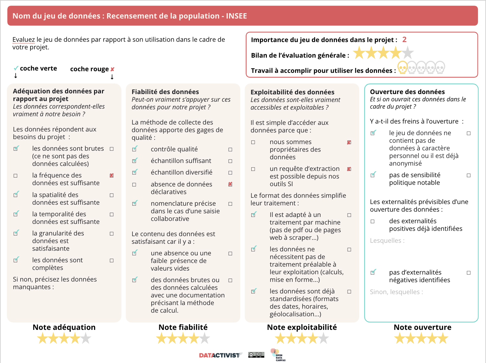
]

---
### .red[Extraire]

.pull-left[

]
--
.pull-right[
**Quels acteurs clés ?**

**Missions :**
* Négocier avec les prestataires

* Comprendre l’organisation physique des données

* Développer des outils d’extraction

]

???

Gestionnaires de données = database managers qui ont pour mission de déployer et
de maintenir les systèmes d’information de leur institution

---
### Exemple de la base de données Apogée

.reduite.center[
[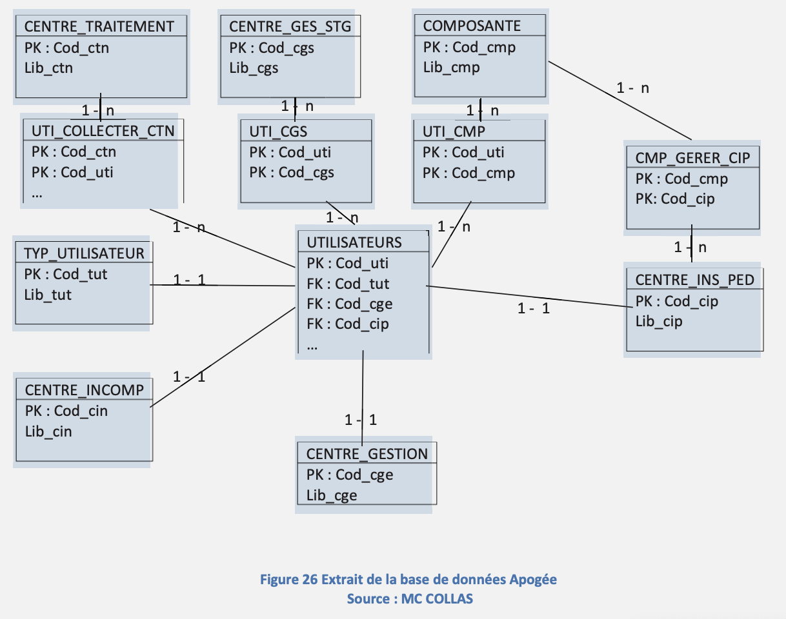](https://dumas.ccsd.cnrs.fr/dumas-01143133/)
]

???

Outil de gestion de la scolarité dans les universités françaises. L’organisation physique des données peut avoir une structure et un nommage très différents de ce qui est exposé dans les vues utilisateurs. Or, l’organisation physique des données peut avoir un nommage très différent ce qui peut compliquer l’ouverture. 

---
### Exemple de clause de sous-traitance

.reduite.pull-left[
[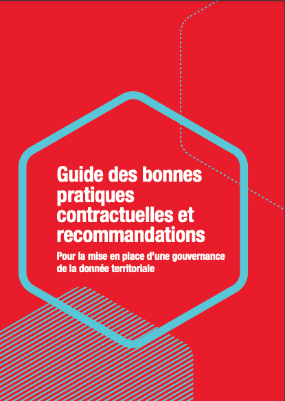](https://www.banquedesterritoires.fr/sites/default/files/2021-01/20-211-BDT-Guide%20des%20bonnes%20pratiques%20contractuelles%20-%20web.pdf)
]

.pull-right[
> En vue de la mise à disposition à titre gratuit des informations publiques, le Délégataire/Titulaire fournira les outils permettant d’extraire et d'exploiter librement tout ou partie des données et bases de données.
]

---
### .red[Éditer]

.pull-left[

]
--
.pull-right[
**Quels acteurs clés ?**

**Missions :**
* Expliciter les données

* Améliorer leur qualité

* Réduire les risques et éviter toute réidentification
]

???

L’édition désigne toutes les opérations qui consistent à modifier le contenu des données avant leur publication.

Un poste de data editor a été créé en 2013 dans l’équipe d’Etalab.

DCP : toute information relative à une personne physique susceptible d'être identifiée, directement ou indirectement.

Réduire les risques : supprimer des champs sensibles

---
### La qualité, un préalable à l'ouverture ?

Etalab considère que, puisque les données publiques sont déjà utilisées par l’administration pour ses missions de service public, elles peuvent être ouvertes sans que les gestionnaires ne se préoccupent de leur qualité : 

> « Les données publiques sont produites ou reçues dans le cadre d’une mission de service public. Elles sont donc généralement d’une qualité permettant le travail quotidien de l’administration et, en fonction de leur destination initiale, une utilisation statistique pertinente. […] Toutefois, les grands systèmes d’information de l’État et des collectivités territoriales, tout comme ceux des entreprises, peuvent parfois comporter des erreurs. L’existence de ces erreurs ne doit pas ralentir la démarche d’ouverture et de partage des données publiques. L’ouverture et le dialogue avec les réutilisateurs favorisent le signalement d’erreurs éventuelles. »

???

Mais, en pratique, lorsqu’ils réclament l’ouverture d’un jeu de données, les
responsables de projet open data ne peuvent pas simplement balayer de la main la question
de la qualité : les agents ne cessent de s’interroger sur la présence possible d’erreurs et d’inexactitudes dans des données, qui pourraient rejaillir sur l’image du service et remettre en cause le professionnalisme de son travail.

---
### [Dataproofer](http://dataproofer.org/) : un outil de contrôle automatique de la qualité

???

Dataproofer pour les CSV ou Google Spreadsheets : cellules à compléter, doublons… Pénible car ne reconnaît pas l'UTF-8 (déclare des erreurs à chaque accent).

---
### [WTFCSV](https://databasic.io/en/wtfcsv/) pour prévisualiser et contrôler un jeu de données

---
### Un temps fort : la journée "Les mains dans la donnée"

**Objectif** :

> pratiquer et comprendre la mise en qualité des données

**Outil utilisé** : l’OpenData Cheatcode

---
### Logigramme de l'anonymisation

.reduite.center[
[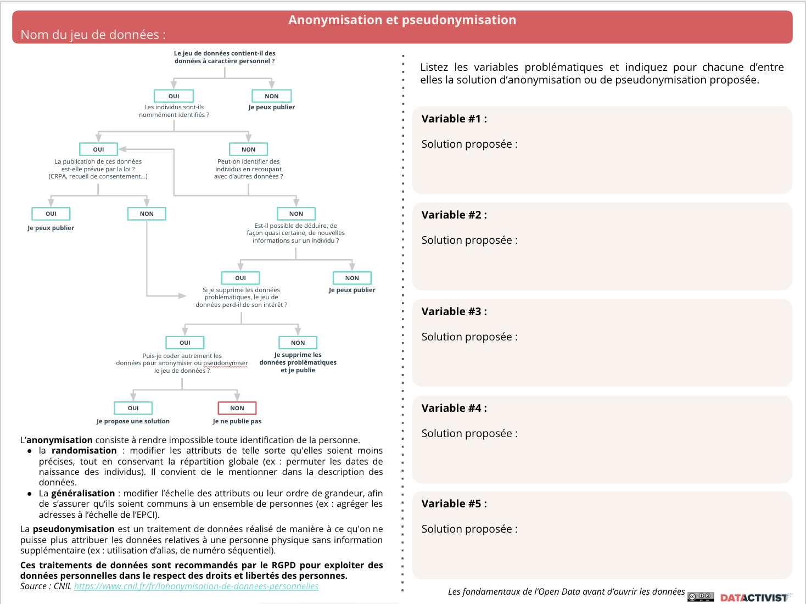](https://github.com/datactivist/oraccle/blob/main/open_data_pipeline/Anonymisation_pseudonymisation.pdf)
]

???

L'article D. 312-1-3 du CRPA prévoit les catégories de documents administratifs pouvant être rendus publics sans faire l'objet d'un processus d'anonymisation, par ex. les documents nécessaires à l'information du public relatifs aux conditions d'organisation de l'administration (organigrammes,  annuaires des administrations, liste des personnes inscrites à un tableau d'avancement ou sur une liste d'aptitude de la fonction publique)

---
### Anonymiser ou pseudonymiser ?

La loi exige "un traitement permettant de rendre impossible l'identification de ces personnes" ; on parle aussi d'occultation.

L'anonymisation comme la pseudonymisation répondent à cette exigence.

> Pour satisfaire à l’obligation d’occultation, **la CNIL préconise d’anonymiser les documents administratifs avant de les diffuser, garantissant ainsi une parfaite impossibilité de réidentification**. Néanmoins, […] **une complète anonymisation est difficile à atteindre et à évaluer et peut aboutir à une trop grande perte d’informations**.
Il y a donc un arbitrage à faire entre la minimisation du risque de réidentification et la préserva‑
tion de l’utilité des données. Trouver le bon curseur n’est pas simple et doit passer par une double
analyse des risques de réidentification, à la fois juridique (pour évaluer par exemple quelles don‑
nées ne doivent pas pouvoir être réidentifiées) et technique (pour estimer la possibilité technique
de réidentifier ces données).

— Etalab, *[Pseudonymiser des documents grâce à l’IA](https://guides.etalab.gouv.fr/pseudonymisation/pourquoi-comment/#qu-est-ce-que-la-pseudonymisation)*, Mars 2022

???
* DCP contenues dans un jeu de données tabulaire = supprimer les colonnes concernées ou chiffrer leur contenu
* DCP dans du texte libre : suppression manuelle ou automatisation par les techniques de traitement du langage naturel cf. https://datascience.etalab.studio/pseudo/

---
### .red[Standardiser]

.pull-left[

]
--
.pull-right[
**Quels acteurs clés ?**

**Missions :**
* Convertir les données dans un format ouvert (spécifications techniques publiques et sans restriction d'accès ni de mise en œuvre) et lisible par les machines

* Adopter des spécifications partagées : GTFS, DECP, IATI, OCDS, socle commun des données locales…

* Transformer les données
]

???

Bien que le format XLSX a été standardisé par l’ISO, Regards Citoyens
comme d’autres acteurs du logiciel libre tels que l’APRIL (l’Association pour la Promotion
de l’Informatique Libre) considèrent que ce format n’est pas ouvert. Ils se réfèrent au cadre
général d’interopérabilité de l’Union Européenne qui définit un standard ouvert, non
seulement par ses spécifications publiques et gratuites, mais aussi par la gouvernance
ouverte de son processus d’élaboration : « le standard est adopté et sera maintenu par une
organisation sans but lucratif et ses évolutions se font sur base d’un processus de décision
ouvert accessible à toutes les parties intéressées (consensus ou vote à la majorité, etc.) ». cf. http://www.regardscitoyens.org/non-excel-et-word-ne-sont-pas-des-formats-ouverts/

---

### Passage en CSV : bien plus que “enregistrer sous”

.red[**À ne pas faire n°1 :] une première ligne qui ne correspond pas à un champ précis**

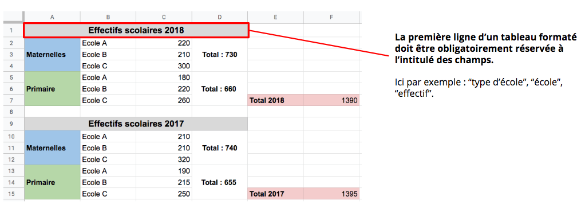

---

### Passage en CSV : bien plus que “enregistrer sous”

.red[**À ne pas faire n°2 :] mettre en forme les cellules**

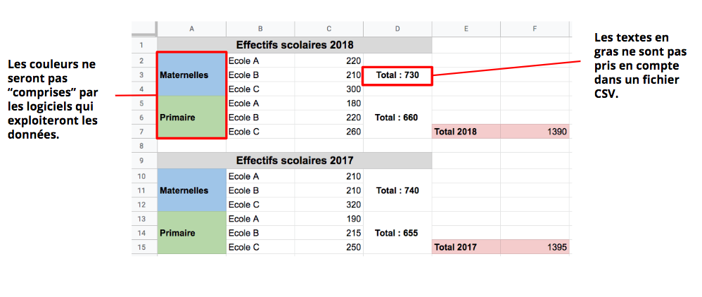

---

### Passage en CSV : bien plus que “enregistrer sous”

.red[**À ne pas faire n°3 :]insérer deux données de nature différente (ou deux objets) sur une même ligne**

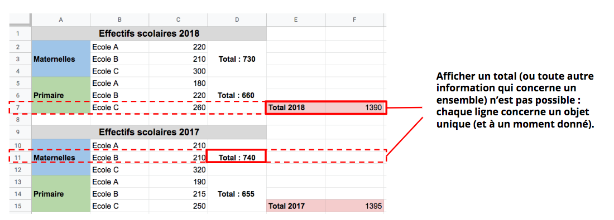
---
### Passage en CSV : bien plus que “enregistrer sous”

.red[**À ne pas faire n°4 :] fusionner des cellules**

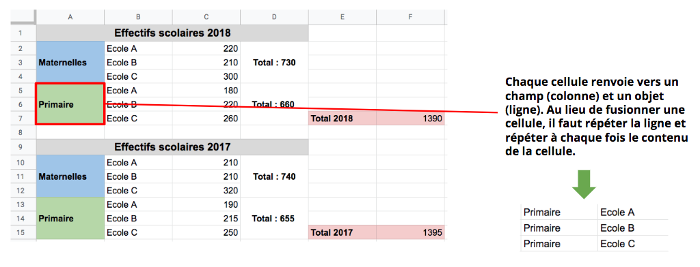

---

### Passage en CSV : bien plus que “enregistrer sous”

.red[**À ne pas faire n°5 :] séparer les tableaux dans des onglets différents ou dans une même feuille**

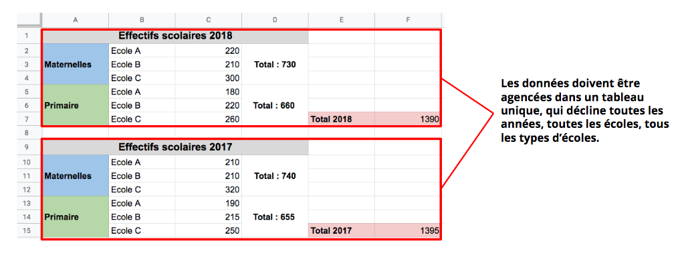

---

### Passage en CSV : bien plus que “enregistrer sous”

.red[**À ne pas faire n°6 :] afficher des totaux ou des informations génériques, ou des données qui n’ont pas de lien avec ce jeu de données précis**

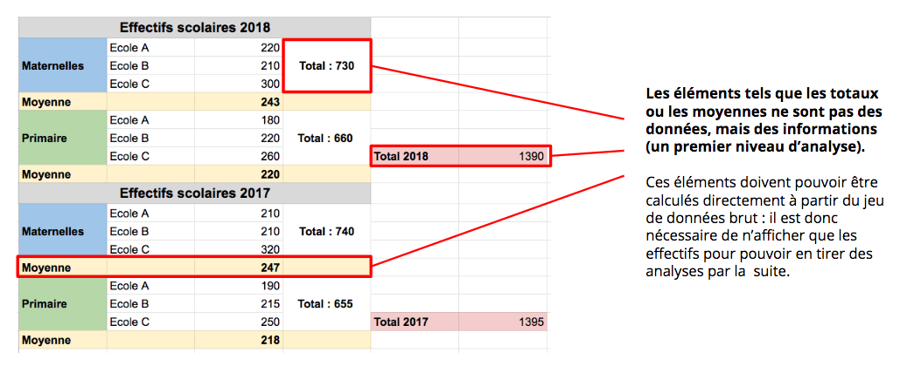

---

### Passage en CSV : bien plus que “enregistrer sous”

.red[**À faire!**] 

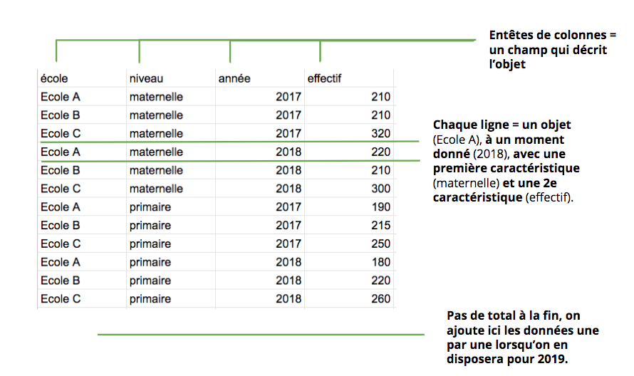

???

Ce qui n'empêche pas des administrations de publier des XLS non conformes : https://www.data.gouv.fr/fr/datasets/le-personnel-administratif-technique-et-dencadrement/

---

### Exemple du standard de publication des registres d'entrée d'archives

* De nombreux services d'archives avaient publié leurs entrées mais...

???
Quelques registres d'entrée des archives disponibles sur data.gouv.fr

---

### Besoin d'un standard !

.pull-left[
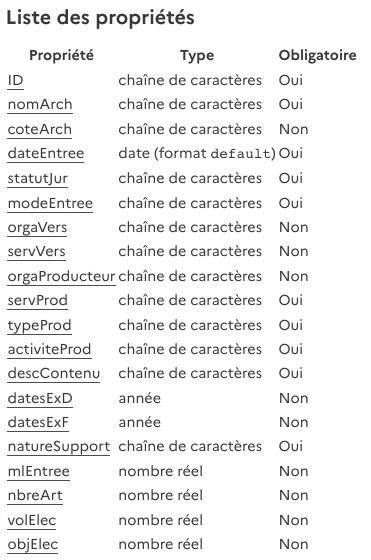
]

.pull-right[
* Le standard de données fournit un cadre commun pour l'ensemble des structures souhaitant diffuser leurs données

* Le standard a été réalisé par Datactivist pour le SIAF et l'AAF, en y associant la communauté

* Il doit permettre de structurer les données avant de les publier sur une plateforme open data ou le site internet d'une institution

Le schéma sur le [site de l'AAF]( https://www.archivistes.org/Ressources-Registres-des-entrees) et sur le site [schema.data.gouv](https://schema.data.gouv.fr/Archivistes75/registre_entrees/latest.html)
]

---

### Les limites du standard

* **Il ne concerne que les registres d'entrées**, les services d'archives gèrent et produisent de nombreuses autres données

* **Il peut nécessiter un certain travail de préparation et de nettoyage** des fichiers. Un travail est en cours avec les éditeurs de SIA pour qu'il soit implémenté dans les logiciels archives

* **Il n'est pas obligatoire**, les services doivent donc faire la démarche de l'utiliser

---

### Que serait un standard des données sur les trajectoires de formation des étudiants ?

???
Pistes :
* profiter de l'existant : standard de dates, de coordonnées géographiques…
* utiliser un identifiant pivot

---

### publier.etalab.studio, pour vérifier la conformité au standard

???

Démo rapide
---
### .red[Publier]

.pull-left[

]
--
.pull-right[
**Quels acteurs clés ?**

**Missions :**
* Importer les données sur le portail

* Décrire les champs du fichier

* Documenter les métadonnées
]

Les métadonnées permettent d'éviter d'avoir un [jeu de données mal documenté](https://www.data.gouv.fr/fr/datasets/c2020-sbep-028/#_).

---
### [Datasheet for Datasets](https://teamopendata.org/t/traduction-et-adaptation-du-modele-de-description-des-donnees-datasheet-for-datasets/1400) : un modèle de documentation des données

Motivations pour la création du jeu de données
* Pourquoi le jeu de données a-t-il été initialement créé ?
* Quelles ont été les utilisations non prévues du jeu de données ?
* Pour quelles autres tâches le jeu de données pourrait-il être utilisé ?
* Quelles sont les utilisations trompeuses du jeu de données ?
* Qui a financé ou soutenu la création du jeu de données ?

Composition du jeu de données

Processus de collecte des données

Pré-traitement des données

Diffusion du jeu de données

Maintenance du jeu de données

Considérations légales et éthiques

???

Exemple : https://www.data.gouv.fr/en/datasets/metadonnees-des-publications-de-linca/

---
### Exemples de données ouvertes

.pull-left[
[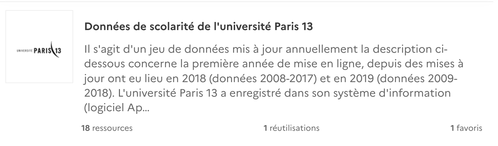](https://www.data.gouv.fr/fr/datasets/donnees-de-scolarite-de-luniversite-paris-13/)

[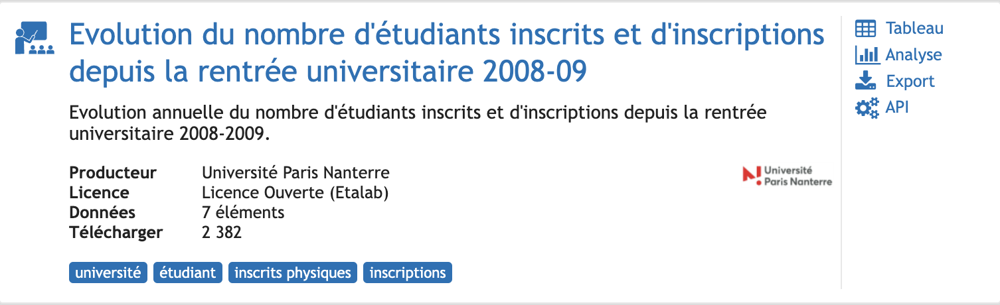](https://opendata.hauts-de-seine.fr/explore/dataset/evolution-du-nombre-detudiants-inscrits-et-dinscriptions-depuis-la-rentree-unive/information/)
 
]

.pull-right[
[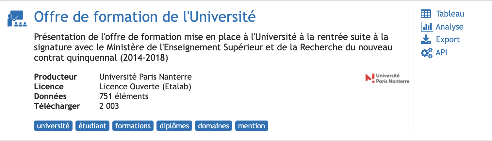](https://opendata.hauts-de-seine.fr/explore/dataset/offre-de-formation-de-luniversite/information/)

[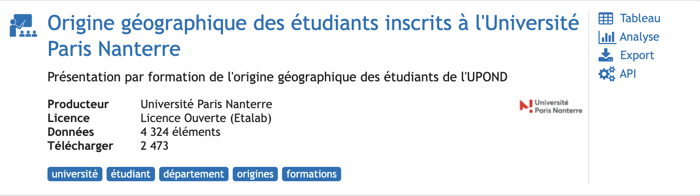](https://opendata.hauts-de-seine.fr/explore/dataset/origine-geographique-des-etudiants-inscrits-a-luniversite/information/?disjunctive.diplome_type&disjunctive.composante)
]

---
### .red[Mettre à jour]

.pull-left[

]
--
.pull-right[
**Quels acteurs clés ?**

**Missions :**
* Mettre à jour manuellement ou automatiser l’ouverture

* Conserver les données

* Prendre en compte les retours des usagers

]

???

Retours des usagers : valeurs erronées, modèle de données, documentation incomplète ou erronnée. L’ouverture des données est une démarche d’amélioration continue. 

---

class: inverse, center, middle

# Merci !

Contact : [antoine@datactivist.coop](mailto:antoine@datactivist.coop)